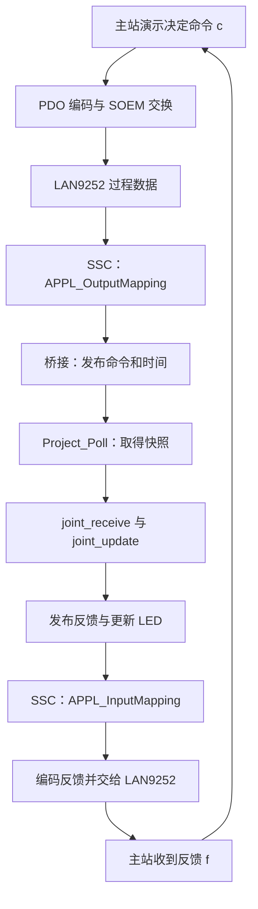

# 第 01 课：从 main 到自己的功能

日期：2026-10-06。课程编号：H01。状态：课件已生成，正在学习，尚未完课。

这节课围绕你已经看见的现象：电脑运行演示，板上使能灯亮、方向灯闪、故障灯闪。我们按源码追踪这些现象由谁安排、在哪里执行、怎样返回电脑。

本课覆盖工程里的两个程序、板端入口、初始化、命令缓存、应用更新、反馈与 LED。读完应能指着具体函数说出“我自己的功能应放在哪里”。这不是一次要求掌握所有 SSC 源码；先把它的入口和边界读清楚。

本课的代码片段取自当前灯版源码，中文解释写在课件中，没有改动源码。文中运算举例会明确标为示意；实测数据来自 2026-10-05 已保存的日志，本课没有重新操作硬件。

## 0. 先打开这几个文件

在 VS Code 中打开项目文件夹。先打开前三个文件并保留为标签页，其他文件读到相应步骤再打开。在编辑器按 `Ctrl+G` 输入行号；按 `Ctrl+F` 搜索函数名可在行号变化后继续定位。

| 顺序 | 点击打开 | 本课重点位置 | 角色 |
|---|---|---|---|
| 1 | [cia402appl.c](../../firmware/generated/cia402appl.c) | 第 845 行 `main`，第 861、862 行两项循环工作 | STM32 的真实应用入口 |
| 2 | [ssc_bridge.c](../../firmware/ssc_bridge.c) | 第 57 行 `Project_Init`、第 106 行 `Project_Poll` | 将协议数据接入应用，操作板载硬件 |
| 3 | [joint.h](../../common/joint.h) | 第 10 行命令，第 16 行反馈，第 22 行完整模型 | 自有应用的数据类型 |
| 4 | [joint.c](../../common/joint.c) | 第 4 行初始化，第 12 行收命令，第 33 行更新 | 模拟关节的业务逻辑 |
| 5 | [pdo.c](../../common/pdo.c) | 第 20 行解命令、第 40 行编码反馈 | 字节与结构体之间的转换 |
| 6 | [joint_master.c](../../master/joint_master.c) | 第 122、125、128、132 行 | 电脑端决定、编码、交换、解析 |
| 7 | [demo_sequence.c](../../master/demo_sequence.c) | 第 22～32 行位置演示阶段 | 电脑端决定要去哪个目标 |

不用因为第一份文件接近 900 行就从头读起。本课第一步直接跳到第 845 行。

## 1. 为什么工程里会有两个 main

先打开 [CMakeLists.txt](../../CMakeLists.txt)，看第 5～12 行和第 53～54 行。

```cmake
option(PROJECT_FIRMWARE "Build STM32F407ZE firmware" OFF)
if(PROJECT_FIRMWARE)
  # 读取板端源文件列表，然后构建 STM32 固件。
  include(firmware/generated/GCCSources.cmake)
  add_executable(ethercat_joint ${BOARD_SOURCES} firmware/startup_f407.c firmware/syscalls.c)
```

电脑端的另一条构建路径中有：

```cmake
add_executable(joint_master master/joint_master.c)
target_link_libraries(joint_master PRIVATE demo_sequence soem)
```

`add_executable` 表示创建一个程序目标。两条构建路径分别产生：

| 程序 | 执行位置 | main 所在文件 | 做什么 |
|---|---|---|---|
| `ethercat_joint.elf` | STM32 | `firmware/generated/cia402appl.c` 第 845 行 | 跑从站协议、更新关节模型、控制灯 |
| `joint_master.exe` | 电脑 | `master/joint_master.c` 第 176 行 | 打开网卡、配置从站、发命令、收反馈 |

同一目录里有多个 `main`，不表示它们按顺序执行。每个构建目标选择自己的源文件，产生独立程序。

`common/joint.c` 和 `common/pdo.c` 是可复用的纯 C 模块。板端编译会用它们，电脑的模型测试也会用它们。目录叫 `common` 不决定代码运行在哪里，具体看哪个构建目标把它编译进去。

商家目录里还有示例入口文件；当前板端源文件列表实际选用了生成后的 CiA402 入口。寻找 main 时要同时看构建列表，不能只看文件名像不像入口。

先在脑中放好这个框架：


## 2. 第一站：板端 main，第 845～864 行

打开 [cia402appl.c](../../firmware/generated/cia402appl.c)，跳到第 845 行。下面是同一段代码，解释性注释放在课件里：

```c
int main(void)
{
    HW_Init();              // 第 848 行：商家硬件与 ESC 访问初始化
    Project_Init();         // 第 850 行：我们的模型、计时与 GPIO 初始化
    MainInit();             // 第 851 行：SSC 的初始化工作
    CiA402_Init();          // 第 854 行：初始化 SSC 的轴相关结构

    APPL_GenerateMapping(&nPdInputSize, &nPdOutputSize); // 第 857 行
    bRunApplication = TRUE; // 第 858 行
    do {
        MainLoop();         // 第 861 行：SSC 的主循环工作
        Project_Poll();     // 第 862 行：我们的应用工作
    } while (bRunApplication == TRUE);

    CiA402_DeallocateAxis(); // 第 866 行：退出应用后清理轴资源
    HW_Release();           // 第 868 行：退出后的硬件释放
    return 0;
}
```

循环条件持续为真时会继续工作；后面的清理代码在循环结束之后才执行。

### 2.1 先读初始化顺序

`HW_Init()` 建立访问硬件的基础。随后 `Project_Init()` 建立自己的应用初始状态。`MainInit()`、`CiA402_Init()` 和映射初始化让协议栈的相关结构准备好。

“先初始化”不等于“已进入 OP”。OP 是主站后续配置、请求和周期通信的结果。

第 857 行的 `&nPdInputSize` 是变量地址。函数拿到地址后可以填写长度。跳到同文件第 782、783 行：

```c
*pInputSize = 12;
*pOutputSize = 12;
```

这里 `*` 表示通过指针写回目标变量；本工程固定输入、输出过程数据各 12 字节。它不是初始化时就发出一份网络报文。

### 2.2 最重要的是循环中的两行

```c
MainLoop();
Project_Poll();
```

在主线程中先执行 SSC 的主循环工作，再执行我们的应用工作，然后重复。`do ... while` 是先执行循环体，再检查继续条件；当前运行标志先被置为 TRUE，因此正常持续运行。

注意三个区别：

- `MainLoop()` 是 SSC 的函数；`Project_Poll()` 是本项目加的应用入口。
- 这里没有固定延时，所以一次主循环不等于 10ms。主站请求的 10ms 是电脑收发节奏。
- 本项目还有 PDI 中断，通信事件可在主循环执行之间发生；不能把所有过程都理解为单线程逐句搬完一帧。

你自己的循环功能适合从 `Project_Poll()` 接入；初始化功能适合从 `Project_Init()` 接入。协议细节通常继续交给 SSC 处理。

这份入口属于自动生成文件，读它有助于确认真正执行顺序。直接修改这里会被生成器重新生成；保存入口适配的地方是 [prepare_firmware.py](../../tools/prepare_firmware.py)，业务修改优先放在自有应用文件中。

补充定位：上电后先经过 [startup_f407.c](../../firmware/startup_f407.c) 的 `Reset_Handler`，初始化内存、系统和 C 运行环境，再调用这里的 main。本课从 main 展开，暂不深挖向量表。

## 3. 第二站：自己的数据到底放在哪里

打开 [ssc_bridge.c](../../firmware/ssc_bridge.c)，看第 10～15 行：

```c
static Joint model;
static JointCommand pending_command;
static JointFeedback published_feedback;
static volatile unsigned received_generation;
static unsigned processed_generation;
static uint32_t received_at;
```

先把变量翻译成职责：

| 名称 | 保存什么 | 谁主要写入 |
|---|---|---|
| `model` | 模型的命令、位置、速度、状态、故障、计时 | 主循环里的应用逻辑 |
| `pending_command` | 最新一次接收并解码的命令 | 命令映射入口 |
| `published_feedback` | 准备给协议栈使用的反馈快照 | 主循环 |
| `received_generation` | 命令发布计数，用于判断有无新发布 | 命令映射入口 |
| `processed_generation` | 应用最后已经处理到哪个计数 | 主循环 |
| `received_at` | 最近命令映射时的 MCU 时间 | 命令映射入口 |

这里的文件级 `static` 表示这些变量在本文件内部使用，并且贯穿程序运行期存在；不会每调用一次函数就重新创建或清零。

`volatile` 告诉编译器这个计数可能被当前代码路径之外的事件改变，需要按访问要求实际读写。它不让整个命令结构体自动变成原子数据，也不代替临界区保护。

### 3.1 到 joint.h 找到这些类型

打开 [joint.h](../../common/joint.h)，看第 10～21 行：

```c
typedef struct {
    uint16_t controlword;
    int32_t target_position;
    int32_t target_velocity;
    int8_t mode;
} JointCommand;

typedef struct {
    uint16_t statusword;
    int32_t position;
    int32_t velocity;
    int8_t mode;
} JointFeedback;
```

`typedef struct` 给一组数据起一个类型名。创建 `JointCommand` 就同时拥有四个字段。`command.target_position` 表示取出这份命令里的目标位置。

- `controlword`、`target_position`、`target_velocity`：主站希望板端怎样工作。
- `statusword`、`position`、`velocity`：板端目前报告的结果。
- `mode`：CSP=8、CSV=9；本项目是教学模拟子集。

`uint16_t` 是无符号 16 位类型；`int32_t` 是有符号 32 位类型，所以目标可以是负值。结构体在内存中的布局不直接作为网络协议布局；网络固定 12 字节由 PDO 编解码明确安排。

再看第 22～30 行的 `Joint`。它把命令、反馈、状态和内部计时等放在一起。因此：

```c
model.command.target_position  // 模型当前保存的目标
model.feedback.position       // 模型当前算出的实际位置
model.state                   // 模型当前的驱动状态
```

这三个值职责不同。目标变成 1000，不要求当前位置同时变成 1000。

## 4. 第三站：Project_Init 怎样建立初始状态

回到 [ssc_bridge.c](../../firmware/ssc_bridge.c)，看第 57～82 行。分成两块读。

### 4.1 第 63～74 行：计时与模型

```c
RCC_GetClocksFreq(&clocks);
timer_clock = clocks.PCLK1_Frequency;
if ((RCC->CFGR & RCC_CFGR_PPRE1) != 0) timer_clock *= 2;
RCC_APB1PeriphClockCmd(RCC_APB1Periph_TIM5, ENABLE);
TIM_TimeBaseStructInit(&timer);
timer.TIM_Prescaler = (uint16_t)(timer_clock / 1000000u - 1u);
timer.TIM_Period = 0xFFFFFFFFu;
TIM_TimeBaseInit(TIM5, &timer);
TIM_Cmd(TIM5, ENABLE);
joint_init(&model, TIM5->CNT);
published_feedback = model.feedback;
received_generation = processed_generation = 0;
```

这段建立 1MHz 的 TIM5 计数，随后用当前计数初始化模型。`TIM5->CNT` 是硬件计数寄存器，在该配置下每递增 1 对应约 1µs 的计数时间；这个配置不是强制主循环每 1µs 执行一次。

`&model` 是模型的地址。`joint_init` 需要修改真实的 model，不能只收到一份副本。

打开 [joint.c](../../common/joint.c)，看第 4～9 行：

```c
void joint_init(Joint *j, uint32_t now)
{
    memset(j, 0, sizeof(*j));
    j->state = JD_DISABLED;
    j->last_update_us = now;
    j->feedback.statusword = 0x0040;
}
```

`j` 是指向模型的指针。`j->state` 等价于 `(*j).state`：修改指针所指模型中的状态。这里先清零，再明确设置“禁止接通”、初始更新时间和状态字。`sizeof(*j)` 是整个模型所占的字节数，覆盖整份模型；不是指针自身大小。

回到桥接第 73 行，结构体赋值 `published_feedback = model.feedback` 复制各字段，建立初始反馈快照。刚启动时有一份明确的禁止状态可提供给通信路径。

### 4.2 第 75～82 行：用户 LED GPIO

```c
RCC_AHB1PeriphClockCmd(RCC_AHB1Periph_GPIOB, ENABLE);
GPIO_SetBits(GPIOB, GPIO_Pin_11 | GPIO_Pin_12 | GPIO_Pin_13 | GPIO_Pin_14 | GPIO_Pin_15);
GPIO_StructInit(&gpio);
gpio.GPIO_Pin = GPIO_Pin_11 | GPIO_Pin_12 | GPIO_Pin_13 | GPIO_Pin_14 | GPIO_Pin_15;
gpio.GPIO_Mode = GPIO_Mode_OUT;
gpio.GPIO_OType = GPIO_OType_PP;
gpio.GPIO_Speed = GPIO_Speed_2MHz;
GPIO_Init(GPIOB, &gpio);
```

这里已经是 STM32 外设操作：开 GPIOB 时钟，先设置输出高电平，再配置五个输出引脚。板上用户灯低电平点亮，所以高电平对应熄灭。

`|` 是按位或，用来合并多个引脚选择。`GPIO_Speed_2MHz` 配置的是 GPIO 输出速度等级，不是让灯每秒闪两百万次。灯的闪烁时间在后面的逻辑里计算。

到这里，你已经找到两个功能位置：建立模型初始值在 `joint_init`；初始化板端外设在 `Project_Init`。

## 5. 第四站：命令怎样从通信进入应用

先回到 [cia402appl.c](../../firmware/generated/cia402appl.c) 第 805～807 行：

```c
void APPL_OutputMapping(UINT16* pData)
{
    Project_OutputMapping(pData);
}
```

这是 SSC 与我们代码的交接点。`Output` 使用主站的输出视角，即电脑发给从站的命令；从从站角度看，叫 RxPDO。

打开 [ssc_bridge.c](../../firmware/ssc_bridge.c)，读第 85～94 行：

```c
void Project_OutputMapping(unsigned short *data)
{
    JointCommand command;
    uint32_t key;
    if (!project_decode_command((const uint8_t *)data, PROJECT_PDO_BYTES, &command)) return;
    key = lock_irq();
    pending_command = command;
    received_at = TIM5->CNT;
    received_generation++;
    unlock_irq(key);
}
```

逐步读这段的作用：

1. 创建本次函数使用的临时命令 `command`。
2. 按固定 12 字节布局解码，结果写到 `command`。类型转换让解码器按字节访问同一缓冲区；转换指针本身不会复制或重新排列数据。
3. 解码返回 0 时，`!0` 为真，执行 `return`，本次函数到此结束。当前调用传入的是已配置的固定长度，不能把这一行当作整个网络帧的完整验证。
4. 进入短临界区，把命令、接收时间、发布计数一起更新。
5. 恢复原来的中断屏蔽状态。

注意：这里没有让位置往前积分，也没有遍历关节状态机。它完成的是“发布最新命令”，应用更新在主循环中进行。

### 5.1 为什么计数增加，即使目标没变

假设上一轮主循环处理到 `processed_generation=40`，通信又发布一次目标仍为 1000 的命令：

```text
pending_command.target_position = 1000
received_generation = 41
received_at = 最新计数时间
```

目标相同，但这仍是新的接收事件。应用知道通信继续有新数据，就能刷新接收时间。不能靠“目标数值是否变化”判断断网。

这份缓存保留最新命令，不是逐帧队列。如果一次主循环之前发布了两份命令，主循环会处理最新快照，计数可能一次增加 2；因此不要把 `model.receive_count` 永远等同于所有线上的帧数量。

### 5.2 临界区保护什么

看桥接第 52～55 行：`lock_irq` 保存原屏蔽状态、暂时屏蔽中断，`unlock_irq` 恢复保存的状态，并配合内存屏障。

要避免的是主循环读取到“一半旧命令、一半新命令”，或者新命令配上旧时间。保护的是相关字段的一致快照，计算模型放在保护区之外。这只是当前单核 MCU 设计的保护方式，不等于任意平台上的通用线程安全方案。

## 6. 第五站：Project_Poll 是自己的循环入口

回到 [ssc_bridge.c](../../firmware/ssc_bridge.c)，看第 106～134 行。按照三段读。

### 6.1 第 111～119 行：取快照，只处理新发布

```c
key = lock_irq();
snapshot = pending_command;
timestamp = received_at;
generation = received_generation;
unlock_irq(key);
if (generation != processed_generation) {
    joint_receive(&model, &snapshot, timestamp);
    processed_generation = generation;
}
```

先在短临界区里复制命令、时间和计数，再离开临界区。如果计数不同，就把这份命令交给模型，并记下已处理计数。

`snapshot` 是复制出来的一份命令。即使接收路径之后又改了缓存，这次已经取得的结构体仍可用于本轮处理。

跳到 [joint.c](../../common/joint.c) 第 12～18 行：

```c
void joint_receive(Joint *j, const JointCommand *c, uint32_t now)
{
    j->command = *c;
    j->last_receive_us = now;
    j->have_command = 1;
    j->receive_count++;
}
```

函数把命令复制进模型，记录接收时间，声明“已经收到命令”，增加模型处理计数。它仍没有更新运动位置。

`const JointCommand *c` 表示函数通过该指针读取命令，不通过它修改输入命令；输出的变化发生在 `j` 所指模型中。

### 6.2 第 120 行：每轮都更新应用

```c
joint_update(&model, TIM5->CNT, bEcatOutputUpdateRunning != 0);
```

这三个参数分别是：要修改的模型、当前 MCU 时间、SSC 当前的有效输出更新许可。

这行在上面的 `if` 外面，所以没有新命令也会调用。否则没有新包时，超时、停止和反馈更新也可能不执行。

打开 [joint.c](../../common/joint.c)，本课读四个位置，其他状态转移留待专课展开：

| 位置 | 关键代码 | 本课要理解什么 |
|---|---|---|
| 第 35 行 | `dt = now - j->last_update_us` | 本次应用更新距离上次过去多久 |
| 第 39～40 行 | 最近接收时间与 `JOINT_TIMEOUT_US` 比较 | 新数据超时检查与接收时间有关 |
| 第 79 行 | 使能、通信许可、无超时、无故障原因 | 满足条件后才允许运动 |
| 第 104～118 行 | 位置、速度、模式、状态字更新 | 由内部模型生成输出反馈 |

两个许可要分开：SSC 的通信输出许可，决定当前通信是否允许应用使用输出；`JD_ENABLED` 是模型的驱动使能状态。二者都有效才进入运动分支。

读第 83～89 行，可以看见 CSP 如何朝目标积分并防止越过目标。运算示意：速度 20000 计数/秒、总计经过 10ms，则位置变化约 200 计数。本实现每轮按实际 `dt` 积累，不要求每一轮主循环正好是 10ms。

`position_micro` 是“教学位置计数 × 1000000”的内部精度表示，名称里的 micro 不表示真实微米。`dt` 使用微秒，这个缩放让短时间更新时仍能积累不足 1 计数的变化。

### 6.3 第 123～134 行：发布结果，再更新灯

```c
published_feedback = model.feedback;
LocalAxes[0].Objects.objStatusWord = model.feedback.statusword;
LocalAxes[0].Objects.objPositionActualValue = model.feedback.position;
LocalAxes[0].Objects.objVelocityActualValue = model.feedback.velocity;
// 同一区域还更新了命令、模式和错误码字段。
```

`published_feedback` 为 PDO 提供一份完整反馈快照；`LocalAxes[0].Objects` 是 SSC 对象字典相关变量，SDO 可读相应字段。它们由同一个模型更新，便于在不同接口观察应用状态；不能据此要求异步 PDO 与 SDO 在任意时刻取得完全同一时间点的值。

第 134 行是：

```c
update_leds(TIM5->CNT);
```

至此，一轮应用路径已经读完：取最新命令 → 刷新模型命令 → 按时间更新模型 → 发布反馈 → 更新灯。

## 7. 第六站：LED 怎样把结果显示出来

仍在 [ssc_bridge.c](../../firmware/ssc_bridge.c)，跳到第 22～49 行。

### 7.1 先读 LED2：第 38 行

```c
if (model.state == JD_ENABLED) lit |= GPIO_Pin_12;
```

这行判断模型的实际状态。如果已使能，把 PB12 加入要点亮的集合。`|=` 表示“保留已经选中的灯，再加上这一位”。

`lit` 只是本函数里的引脚位集合。真正设置电平是第 48、49 行：

```c
GPIO_SetBits(GPIOB, (uint16_t)(pins & ~lit));
GPIO_ResetBits(GPIOB, lit);
```

`pins` 是五个受控灯的集合；`pins & ~lit` 选出其中应熄灭的灯。高电平熄灭，低电平点亮。这里把业务状态转换成 STM32 GPIO 操作。

### 7.2 再读 LED3/4：第 28～42 行

模型实际速度非零时，程序记住它的方向和时间。最后一次非零速度后，方向最多保持 300ms，或在不再使能时清除。这样很短的 CSP 小步也能被看到。

第 40 行控制闪烁节奏：

```c
if ((now / 250000u) % 2u == 0) {
    if (motion_direction > 0) lit |= GPIO_Pin_13;
    if (motion_direction < 0) lit |= GPIO_Pin_14;
}
```

`now` 单位为 µs。除以 250000 后，每 250ms 商增加 1；再 `% 2`，商的奇偶决定亮灭。亮 250ms、灭 250ms，一轮完整闪烁为 500ms，即每秒约两轮。

在同一使能阶段方向灯可能因为 300ms 保持而继续闪一会儿。它是“最近实际运动方向”的可见提示，不是每一瞬间速度的精密仪表。

### 7.3 LED1/5 与为何不用长 delay

- 第 26、37 行：有效输出更新、已收到命令、未超时时，LED1 常亮；否则按 500ms 亮灭周期做空闲心跳。
- 第 45～46 行：应用进入 Fault 或 Fault Reaction，LED5 按 125ms 亮灭节奏快闪。
- 第 34 行：没到 10ms 显示更新间隔就立即返回。它限制写 GPIO 的频率，没有让 CPU 原地等待。

如果在这个函数里等待 500ms，整个主循环会被阻塞，协议主循环和应用超时处理也会受到影响。这里用“当前时间是否满足条件”决定结果，然后尽快返回，适合与通信共同运行。

改变“故障什么时候出现”应看模型逻辑；改变“故障出现后灯怎样闪”应看显示逻辑。这两项可以独立理解。

## 8. 第七站：反馈怎样返回电脑

打开 [cia402appl.c](../../firmware/generated/cia402appl.c) 第 793～795 行，看到 SSC 调用 `Project_InputMapping(pData)`。这里 `Input` 使用主站输入视角，即电脑从板端接收的数据；从从站看，是 TxPDO。

回到 [ssc_bridge.c](../../firmware/ssc_bridge.c) 第 97～103 行：

```c
void Project_InputMapping(unsigned short *data)
{
    JointFeedback snapshot;
    uint32_t key = lock_irq();
    snapshot = published_feedback;
    unlock_irq(key);
    project_encode_feedback((uint8_t *)data, &snapshot);
}
```

它先取完整反馈快照，再编码到 SSC 提供的过程数据缓冲区。SSC 负责后续通过硬件访问将过程数据交给 ESC。

最后去 [joint_master.c](../../master/joint_master.c) 第 122～133 行，看电脑对应的四项工作：

```c
result = visual ? demo_next_visual(&demo, &f, &c) : demo_next(&demo, &f, &c);
project_encode_command(context.slavelist[1].outputs, &c);
r->wkc = exchange();
if (!project_decode_feedback(context.slavelist[1].inputs, PROJECT_PDO_BYTES, &f)) {
    result = -1;
    break;
}
```

实际代码还包含周期等待、WKC 检查和日志，本段抽取决策、编码、交换、解析四项工作。`c` 是电脑即将发出的命令，`f` 是已经收回并解析的反馈；下一周期决策使用更新后的 `f`。

至此完整数据路径是：



这是数据依赖图，不表示所有节点都在一次主循环或一帧内按箭头同步执行。接收、模型更新、反馈发布与主站采样分开发生，所以发出命令后可能隔几轮才看见变化。

## 9. 用你之前的实测结果检验代码理解

本节读取 [原快速演示 CSV](../../evidence/logs/20261005_demo_refresh_state.csv)。它是 2026-10-05 已保存的首次快速演示日志，和你当时贴出的使能顺序对应。本课未重新运行它；当前 `hardware.csv` 可被后续慢速演示覆盖，不把两份日志混用。

关键原始字段如下：

| cycle | cw | sw | target | actual | velocity |
|---:|---|---|---:|---:|---:|
| 0 | 0x0006 | 0x0040 | 0 | 0 | 0 |
| 2 | 0x0006 | 0x0021 | 0 | 0 | 0 |
| 5 | 0x0007 | 0x0023 | 0 | 0 | 0 |
| 8 | 0x000f | 0x0427 | 0 | 0 | 0 |
| 10 | 0x000f | 0x0427 | 1000 | 0 | 0 |
| 12 | 0x000f | 0x0027 | 1000 | 198 | 20000 |
| 13 | 0x000f | 0x0027 | 1000 | 398 | 20000 |
| 17 | 0x000f | 0x0427 | 1000 | 1000 | 0 |

对应源码解释：

1. 主站决定 cw；桥接接收，模型处理后生成 sw。两者不要求在同一行已经匹配。
2. 第 10 周期主站发目标 1000，但该行还读到之前发布的反馈。
3. 第 12～13 周期，模型已开始积分，反馈位置从 198 到 398，变化约 200；该结果与速度 20000 计数/秒、约 10ms 采样间隔相符。
4. 第 17 周期目标到达，速度变为 0；状态字里的 0x0400 到达标志置位，与 0x0027 合起来是 0x0427。

两行延后本身不能当作单程网络时延测量。当前数据来自多个异步处理与采样环节。

你昨天的慢速灯演示另外使用逐步调整的 CSP 目标和阶段保持：第 26、27 行在位置反馈基础上推进 10 计数；因此慢速 CSV 的目标不总是直接跳到 ±1000，不能拿快演示的每行目标去逐行套它。

若想只在电脑上查看已保存日志，可在项目根目录执行下面的读取命令。它不启动主站、不访问开发板：

```powershell
Import-Csv '.\evidence\logs\20261005_demo_refresh_state.csv' |
    Select-Object -First 18 cycle,cw,sw,target,actual,velocity,mode |
    Format-Table -AutoSize
```

## 10. 你想写功能时，具体从哪里动手

| 你想实现的变化 | 首先定位 | 修改属于哪一层 |
|---|---|---|
| 改板载灯闪烁时间、显示条件 | 桥接第 22 行 `update_leds` | STM32 应用的硬件显示 |
| 初始化一个外设，之后定期读取 | 第 57 行 `Project_Init`，第 106 行 `Project_Poll` 的应用调用点 | 板端外设与应用接入 |
| 改模拟关节的运动规律、限值、故障处理 | 模型第 33 行 `joint_update` 与 `joint.h` 参数 | 业务逻辑 |
| 改电脑发出的目标或动作顺序 | 演示第 9 行 `next_mode` | 电脑主站业务 |
| 在网络里增加一个传输量 | 命令/反馈类型、PDO 编解码、对象字典映射、ESI 与主站校验 | 跨模块通信接口，需要一起对齐 |

新增功能模块时，可以把初始化函数从 `Project_Init` 调用，把每轮处理函数从 `Project_Poll` 调用；新增 C 源文件还要加入实际 CMake 构建目标。第一课先认清接入位置，不直接重构现有模型或协议栈。

## 11. 本课练习：先写解释，再写修改方案

到 [学习记录](学习记录.md) 的 H01 练习区填写。先自行回答，再看下方参考解释；尚未写答案的空白不代表做错。

### 练习 A：画出职责边界

1. `main` 中哪一行调用我们的循环功能？
2. 把 `Project_OutputMapping`、`joint_update`、`Project_InputMapping` 分别归类为“收命令”“执行功能”“准备反馈”。
3. 为什么重复收到同一个目标 1000，也要更新接收时间？
4. 没有新命令时，为什么第 120 行仍要运行？

### 练习 B：手算一轮数据发布

起始：`received_generation=8`、`processed_generation=8`。

两次命令映射发生在下一次主循环之前：第一份目标 1000，第二份目标 -1000。

请写出主循环取得的 generation、snapshot 目标、是否调用 `joint_receive`，以及处理后的 `processed_generation`。这个设计会逐份处理两条命令吗？

### 练习 C：提出一个小修改

在纸上或学习记录里，把桥接第 37 行 LED1 空闲闪烁用的 `500000u` 改为 `250000u`，其余条件保持原样。写出修改后的整句以及：

- 空闲亮、灭各持续多久？完整一轮多少毫秒？
- 原先每秒约一轮，修改后每秒约几轮？
- 在有效周期通信期间，LED1 是否还会按这个节奏闪？
- 是否需要调整 PDO 的 12 字节布局？

这是修改方案练习，不是已经改动源码或烧录板子。本课先计算并解释，后续再在明确的小任务中执行修改。

### 参考解释

- A1：第 862 行 `Project_Poll()`。
- A2：映射入口发布命令；`joint_update` 执行业务；输入映射复制并编码反馈。
- A3：相同目标可以是一次新接收事件，说明通信继续进行；只看目标变化会把正常保持目标误判成没有新数据。
- A4：应用仍需要检查超时、处理通信许可与状态、生成反馈；同一有效命令在通信正常时也可持续作用。
- B：generation 为 10，snapshot 目标为 -1000；只对取得的最新快照调用一次 `joint_receive`，最后 processed_generation=10。这是一份最新值缓存，非逐帧队列。
- C 的修改句：`if (op || (now / 250000u) % 2u == 0) lit |= GPIO_Pin_11;` 空闲亮灭各 250ms，完整一轮 500ms，约两轮/秒；`op` 为真时条件始终成立，常亮；只改显示节奏，不改通信布局。

### B 题详细解析：两次发布，主循环只取最新的一份

2026-10-06 补讲。以下是按当前源码推演的教师解析，不是新的实板实验，也不代表学习者已完成练习。

**答案：主循环取得的 `generation=10`，`snapshot.target_position=-1000`；本轮调用一次 `joint_receive`，随后 `processed_generation=10`。第一份目标 1000 在主循环取快照之前已经被第二份覆盖。**

#### 第一步：认识变量各自记录什么

打开 [ssc_bridge.c](../../firmware/ssc_bridge.c)，先看第 11～15 行，再看第 85 行 `Project_OutputMapping`。

| 变量 | 含义 | 本题要注意的地方 |
|---|---|---|
| `pending_command` | 最新发布的一整份命令 | 只有一个结构体存储位置，不是命令数组或队列 |
| `received_generation` | 每次成功解码并发布命令后递增的版本号 | 是发布进度，不是等待执行的命令数量 |
| `processed_generation` | 主循环最近交给模型的命令版本号 | 用来判断缓存是否比上次处理时更新了 |
| `snapshot` | 本轮主循环取得的命令副本 | 从共享缓存复制出来后，本轮使用这份局部数据 |
| `received_at` | 最新命令发布时的计时器读数 | 与最新命令一起覆盖，供模型判断超时 |

起始两个版本号都是 8，意思是“上次处理已经跟上版本 8”。题目没有给出此时旧命令的目标，不需要假设它是 0。

#### 第二步：第一份目标 1000 到来

第 91～93 行是本题的核心：

```c
pending_command = command;
received_at = TIM5->CNT;
received_generation++;
```

假设这份命令成功解码，`command.target_position=1000`。结构体赋值会复制整份命令，包括控制字、目标位置、目标速度和模式，并不只复制目标位置。

执行后：

```text
pending_command.target_position = 1000
received_generation = 9
processed_generation = 8
```

`processed_generation` 还没变，因为这段函数负责发布命令，尚未调用 `joint_receive`。版本 9 已在缓存里，但本题假设主循环还没有取得它。

#### 第三步：主循环之前，第二份目标 -1000 又到来

同样三行代码再次执行：

```text
pending_command.target_position = -1000
received_generation = 10
processed_generation = 8
```

这里的 `pending_command = command` 是覆盖同一个结构体，不是追加到列表。于是缓存现在保留第二份命令，第一份目标 1000 不再保存在这个缓存里。时间戳也变成第二次发布时的读数。

可把它想成一块只写当前指令的白板：第一次写 1000，第二次擦掉改写 -1000。白板旁的版本号从 8 变成 9，再变成 10；版本号递增不会让白板自动保存历史指令。

#### 第四步：主循环取得快照

转到同一文件第 106 行 `Project_Poll`，看第 111～115 行：

```c
key = lock_irq();
snapshot = pending_command;
timestamp = received_at;
generation = received_generation;
unlock_irq(key);
```

这时缓存已经是第二份，所以局部变量取得：

```text
snapshot.target_position = -1000
generation = 10
timestamp = 第二次发布的计时器读数
```

短临界区让命令、时间戳、版本号作为一致的一组被读取，避免读到一半时被相关中断更新。`snapshot` 是复制出的局部结构体；之后全局 `pending_command` 再被更新，也不会改掉已经复制好的这份快照。

#### 第五步：判断是否有新版本，再交给模型

继续看第 116～118 行：

```c
if (generation != processed_generation) {
    joint_receive(&model, &snapshot, timestamp);
    processed_generation = generation;
}
```

本轮代入数值就是：

```text
10 != 8 → 条件成立
调用一次 joint_receive，传入目标 -1000 的快照
processed_generation = 10
```

这里是一个 `if`，没有按照版本差值循环两次。虽然 `10-8=2` 表明这期间发布了两份命令，主循环手里仍然只有最新的一份数据，无法从版本号还原被覆盖的目标 1000。

打开 [joint.c](../../common/joint.c) 第 12 行，可以继续追到接收函数：

```c
void joint_receive(Joint *j, const JointCommand *c, uint32_t now)
{
    /* 每次有效 PDO 接收事件都刷新时间；相同目标值也是新帧。 */
    j->command = *c;
    j->last_receive_us = now;
    j->have_command = 1;
    j->receive_count++;
}
```

在这个调用中，`j` 指向 `model`，`c` 指向 `snapshot`，`now` 就是刚才的 `timestamp`。因此模型保存第二份完整命令，把接收时间更新为第二次发布的时间，并将自身的 `receive_count` 加 1。

要区分两个计数：桥接的 `received_generation` 本题增加 2；模型的 `receive_count` 本题只增加 1。源码注释所说的接收事件在这个函数里对应一次实际调用，不能把模型计数直接当作所有 PDO 发布次数。

`joint_receive` 本身只是接收并保存命令，没有直接把实际位置设为 -1000。接下来的 `joint_update` 才根据使能状态、工作模式、时间间隔和限值决定状态与运动。本题只给了目标和版本号，无法据此算出实际位置。

#### 把全过程放在一张表里

| 时刻 | 缓存中的目标 | received_generation | processed_generation | 本题新增 joint_receive 调用次数 |
|---|---:|---:|---:|---:|
| 起始 | 旧目标，题目未给出 | 8 | 8 | 0 |
| 发布第一份命令后 | 1000 | 9 | 8 | 0 |
| 发布第二份命令后 | -1000 | 10 | 8 | 0 |
| 主循环刚取得快照 | -1000 | 10 | 8 | 0 |
| 主循环处理快照后 | -1000 | 10 | 10 | 1 |

#### 两个容易混淆的后续情况

**下一轮没有新命令：** `generation=10` 与 `processed_generation=10` 相等，不再调用 `joint_receive`；但第 120 行 `joint_update` 在 `if` 外面，仍然会执行。没有新目标不等于停止更新运动、状态或超时检查。

**如果两次发布之间主循环已经取过快照并处理：** 它会先处理版本 9 的目标 1000，随后有机会处理版本 10 的目标 -1000。可见本题结果取决于“两次发布都发生在下一次主循环取快照之前”这一前提，并不是任何时候都只处理第二份。

#### 这个设计意味着什么

这是最新值缓存，适合应用只需要知道当前最新命令的场景。它没有承诺逐份执行所有中间目标。第一份命令已经成功发布到缓存，随后被覆盖；不能由此推断网络丢包。

如果功能要求每条事件都必须处理一次，例如逐个累计的操作请求，就需要另外设计事件保存与消费机制。当前代码也可能漏掉只存在于被覆盖命令中的短暂控制字变化。主站的状态切换应结合反馈确认，并按需要持续发送相关控制字；不能靠“只发一帧，默认已经执行”来保证动作完成。本课先理解现有行为，不改成队列。

你可以用这个变化检查自己的理解：起始仍是两个版本号 8，两份目标仍是 1000、-1000，但在它们之间插入一次完整的 `Project_Poll`。分别写出两轮快照目标和处理后的版本号，并说明这与原题哪里不同。

## 12. 这一课怎样算学完

你能不看参考答案说出下面这条链路，并指出每段实际函数，就达到了本课目标：

```text
板端 main
→ 初始化应用
→ 命令映射发布最新命令
→ Project_Poll 取得快照
→ joint_receive 保存命令
→ joint_update 更新状态和运动
→ 发布反馈、更新 LED
→ 输入映射编码反馈
→ 电脑解析返回值
```

另外能判断三种修改的位置：改闪灯节奏、改板端运动行为、改电脑目标。完成本课练习后，再由你明确确认完课；教师生成课件和解释过代码不自动视为完成。

下一课沿当前路径展开 `pdo.c`，看一条命令怎样按字节编码、解码及校验。当前课的记录入口：[学习记录](学习记录.md)。
