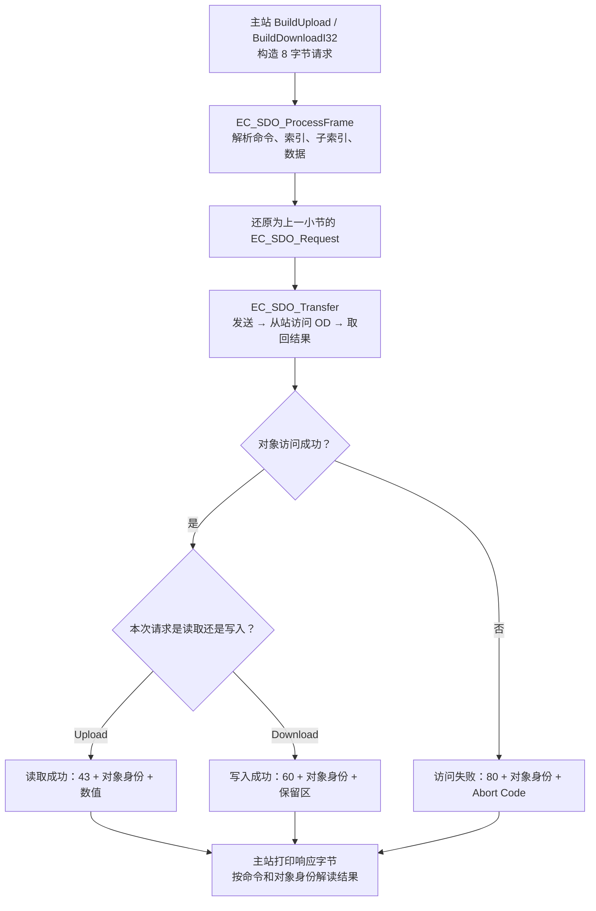

# 第八课第二步：把 SDO 请求变成字节

第一小节的请求/响应、6000 练习及流程图已归档为 lesson-08-part1。本小节只增加一个字节编解码模块，保留原来的邮箱和对象字典。

先看布局和输出，随后只读 main 中「第八课第二小节从这里开始」。不要求立即独立写协议解析器。

## 1. 这一节解决什么

之前的 C 请求结构体表达了「读写哪个对象、写什么值」。实际通信需要明确每个字节的含义，不能直接发送含有枚举、填充和本机字节序的结构体。

我们先实现 expedited SDO（快速传输）中显式标明 4 字节长度的形式。它能把一个 32 位数放在一笔请求或响应里，适合本项目的 int32_t 位置对象。

范围：以下 8 字节是 **SDO 内容**。完整邮箱消息外面还有 Mailbox 头和 CoE 头，随后还要通过 EtherCAT Datagram 传输。当前仍是软件模拟，不进行网卡/ESC 收发，也没有分段传输或超时重试。

核对资料：[SOES 协议定义](https://openethercatsociety.github.io/doc/soes/esc_8h.html)、[固定版本 SOEM 的 SDO 结构与处理](https://github.com/OpenEtherCATsociety/SOEM/blob/88e8ed46efba7dfa7b94d08a512db25a33e3f8d5/src/ec_coe.c)、[SDO 命令常量](https://github.com/OpenEtherCATsociety/SOEM/blob/88e8ed46efba7dfa7b94d08a512db25a33e3f8d5/include/soem/ec_type.h)。本项目独立编写教学实现，只依据协议字段和常量核对，不引入第三方协议栈代码。

## 2. 先记住四个字段

| 字节偏移 | 字段 | 本节例子 |
|---|---|---|
| 0 | Command，命令字 | 0x40 读请求，0x23 写入 4 字节 |
| 1–2 | Index，索引，低字节在前 | 0x607A → 7A 60 |
| 3 | SubIndex，子索引 | 00 |
| 4–7 | 数据、保留区或错误码 | 根据命令决定用途 |

主站读目标位置的请求：

```text
40 | 7A 60 | 00 | 00 00 00 00
读   索引    子索引  读请求保留区
```

从站当前目标为 6000 = 0x00001770，因此返回：

```text
43 | 7A 60 | 00 | 70 17 00 00
返回4字节           位置 6000
```

这里又用到了第六课的小端顺序：6000 的低字节 70 放在前面。

## 3. 写入 7000 的完整事务

7000 = 0x00001B58。主站构造：

```text
23 | 7A 60 | 00 | 58 1B 00 00
写4字节             位置 7000
```

从站解码后相当于上一小节的 Download 请求。原来的 EC_SDO_Transfer 调用字典写函数，目标位置改为 7000。

写入成功的响应：

```text
60 | 7A 60 | 00 | 00 00 00 00
成功确认            保留区
```

成功写响应不需要再携带 7000；可以发送一次 Upload 请求读回确认。

命令字有位含义，并非任意编号。0x23 中高三位表示启动 Download，低两位分别标记 expedited 和 size indicated；当前四字节都有效，不需要标记未使用的数据字节。0x43 使用对应的 Upload 响应命令位，其余标记相同。初读时先理解整字节的作用，位拆解可以稍后回看。

## 4. 把只读拒绝返回给主站

写实际位置 0x6064:00 会被字典拒绝。字节层把本地 READ_ONLY 转换为标准 SDO Abort Code：0x06010002。

```text
80 | 64 60 | 00 | 02 00 01 06
失败响应            错误码 0x06010002
```

主站先看命令 80，知道这是 Abort，再从最后四字节解析错误码。上一小节的 EC_OD_Result 是程序内的枚举；本节的 Abort Code 是协议规定的 32 位数，两者通过转换函数关联。

本节也区分「对象索引不存在」0x06020000 和「子索引不存在」0x06090011。其他未支持的命令返回相应失败，不继续修改变量。客户端发来的 Abort 不生成回复；本模型没有需要取消的分段会话。

## 5. 程序运行流程图



这是支持的请求在空闲模拟邮箱中的完整路径。参数无效或邮箱忙时 ProcessFrame 返回 false；未支持的命令可以直接生成 Abort，不进入对象访问路径。

整段 main 的前面仍按原顺序完成 PDO、对象字典和第一小节。第二小节接在它们后面，所以先读到上一小节保存的 6000，再写成 7000，最后验证只读错误。完整主流程见[程序运行流程图](../docs/程序运行流程图.md)。

## 6. 运行结果

仍在 Project_L 执行：

```powershell
.\EtherCAT_Slave_Simulator\build.ps1
```

前面的输出保留，新增：

```text
Lesson 8 part 2: 8-byte expedited SDO content
Wire Upload request: 40 7A 60 00 00 00 00 00
Wire Upload response: 43 7A 60 00 70 17 00 00
Wire Upload value=6000
Wire Download request: 23 7A 60 00 58 1B 00 00
Wire Download response: 60 7A 60 00 00 00 00 00
Wire Upload after write: 43 7A 60 00 58 1B 00 00
Wire Upload after write value=7000
Wire read-only Abort: 80 64 60 00 02 00 01 06
Abort code=0x06010002, actual_position=300
```

## 7. 读代码时只抓三步

新模块为 EtherCAT/ethercat_sdo_wire.h 和 .c。ProcessFrame 的三步分别是：

1. 从 bytes[0]、索引两字节、bytes[3]、bytes + 4 中解码。
2. 调用原来的 EC_SDO_Transfer，不另写一套字典或位置变量。
3. 根据结果编码响应，主站再检查命令及对象身份后读数值。

前四字节通过 InitFrame 明确赋值；最后四字节通过 WriteU32 明确打包。每次先清零，避免响应保留区带入上一笔数据。

EC_SDO_Frame 是只含 8 字节数组的教学容器。函数要求传入完整有效的容器；这里还没有解析外层网络报文及其长度。通用 EtherCAT 报文接收必须另做长度和格式检查。

## 8. 一个小练习

把 main 中第二小节的 `wire_target = 7000` 改为 8000。先预测写请求最后四字节，再编译运行。前面的 6000 练习保持不变。

本小节先达到「能解释请求及成功、失败响应的每个字段」即可。确认第八课结束后，再归档 lesson-08 并进入第九课 SyncManager 与 FMMU。
