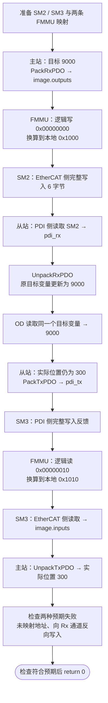

# 第九课：PDO 怎样到达从站变量

第八课已完成并归档为 `lesson-08`。本课开始版本为 `lesson-09-start`，目前学习中。

这一课先只解决一个问题：第六课的 6 字节 PDO，怎样经过 ESC 本地数据区到达从站应用？沿用原来的打包、解包函数，不增加新的 PDO 字段。

学习目标：能沿流程图解释 FMMU、SyncManager、DPRAM、PDI 各自的作用，并指出“哪一步真正更新了目标位置变量”。先读 main 中第九课的五步；不要求独立写底层模块。

## 1. 从已经会的部分接上来

第六课为了简化，直接这样做：

```text
主站 Pack → image.outputs → 从站 Unpack → slave_command.target_position
```

这次在中间补上地址和本地数据区：

```text
主站 Pack → 逻辑地址 → FMMU → SM 管理的本地数据区 → PDI 读 → Unpack
```

主站与从站各有自己的内存。真实通信中，主站不会把本机数组的指针传给 STM32；ESC 处理经过的报文，STM32 再通过本地接口获取数据。

## 2. 先理解四个名称

| 名称 | 作用 | 本课对应代码 |
|---|---|---|
| FMMU | 将逻辑地址范围映射到 ESC 本地地址范围 | EC_FMMU_Translate |
| SyncManager，简称 SM | 管理一段本地数据区的访问方向与一致的数据交接 | EC_SM_Write / EC_SM_Read |
| DPRAM | ESC 中用于交换数据的双端口 RAM | 每个 SM 的 bytes[6] 代表自己的数据区 |
| PDI | 从站处理器访问 ESC 的本地接口 | 调用时指定 EC_SM_PDI_SIDE |

FMMU 的基本换算是：

```text
本地地址 = 本地起点 +（请求的逻辑地址 − 逻辑起点）
```

换算之前要检查方向和范围。**地址换算本身不复制字节，不解包 PDO，也不访问对象字典。**

SM 则决定谁可以写、谁可以读，并交付完整的一份数据。真实 ESC 的过程数据 SM 通常使用三缓冲，读端获得一致的最新数据；邮箱型 SM 通常使用单缓冲和逐笔握手。两者用途不同：过程数据允许新值替换尚未读取的旧值，而邮箱要避免覆盖尚未取走的消息。

依据：[Beckhoff 官方 FMMU / SM 说明](https://infosys.beckhoff.com/content/1033/tc3_io_intro/4981170059.html)。本课只用顺序调用的整块复制表达“完整发布 → 读取最新完整值”，没有实现硬件三缓冲、并发访问或真实 PDI 驱动。

## 3. 一定要区分这几种数字

| 数字 | 含义 | 能不能互换？ |
|---|---|---|
| 0x607A:00 | 目标位置对象的索引和子索引 | 是对象身份，不是内存地址 |
| PDO 偏移 2 | 目标位置在本课 6 字节 PDO 中从第几个字节开始 | 来自固定 PDO 布局 |
| 逻辑地址 0x00000000 | 本例主站写命令数据的逻辑起点 | 由本例配置选择 |
| 本地地址 0x1000 | 本例从站命令数据区的起点 | 由本例配置选择，不是 C 指针 |

FMMU 不知道目标位置叫 0x607A。它只按配置换算地址；从站软件按 PDO 布局解包，才把目标值放入 slave_command.target_position。对象字典随后通过已有指针访问同一个变量。

## 4. 本课只配置两个方向

| 数据 | 主站逻辑区间 | ESC 本地区间 | 本例 SM | 谁写 → 谁读 |
|---|---|---|---|---|
| RxPDO 命令，6 字节 | 0x00000000–0x00000005 | 0x1000–0x1005 | SM2 | EtherCAT 侧 → PDI 侧 |
| TxPDO 反馈，6 字节 | 0x00000010–0x00000015 | 0x1010–0x1015 | SM3 | PDI 侧 → EtherCAT 侧 |

这些地址是教学选择，并非所有从站都必须用它们；SM2/SM3 是本例采用的常见分配。配置放在第九课演示开头；真实系统会在启动阶段配置 ESC，本课在已进入 OP 的累计示例末尾准备软件模型。

命令区的目标位置从 PDO 偏移 2 开始，因此：

```text
逻辑 0x00000002 → 本地 0x1002，随后连续 4 字节存目标位置
```

在本例中 FMMU 可以计算子区间地址，但 SM 接口只支持从起点完整复制 6 字节，不支持拆成几笔部分写入。先保证一次得到完整命令，避免混用旧控制字和新目标位置。

## 5. 程序运行流程图

前面的第六、七、八课依次演示完，再执行下面的第九课流程。主站和从站仍是同一程序中的模拟角色；每个函数都执行完成后才进入下一步。



正常流程中的函数返回值必须检查。成功路径之外的意外失败让 main 返回 1；最后的两次拒绝是故意演示，符合预期则正常结束。

完整累计流程见[程序运行流程图](../docs/程序运行流程图.md)。

## 6. 编译运行并观察

修改后保存文件，在 Project_L 根目录执行：

```powershell
.\EtherCAT_Slave_Simulator\build.ps1
```

脚本重新编译再运行。前面第六至八课的输出仍保留，末尾新增：

```text
Lesson 9: FMMU / SyncManager process data path
Mapped master outputs: 00 00 28 23 00 00
Rx mapping: logical=0x00000000 -> physical=0x1000, length=6
PDI RxPDO: slave target_position=9000
OD sees mapped target=9000
Tx mapping: logical=0x00000010 -> physical=0x1010, length=6
Mapped master inputs: 00 00 2C 01 00 00
Mapped feedback: actual_position=300
Unmapped logical 0x00000020: REJECTED
PDI write to Rx SM2: WRONG_DIRECTION, slave target_position=9000
```

9000 = 0x00002328，所以命令六字节是 `00 00 28 23 00 00`。FMMU 改变的是数据对应的地址，数据本身仍是第六课的小端布局。

REJECTED：逻辑地址 0x20 不属于本例 Rx 映射。WRONG_DIRECTION：Rx 通道的命令来自主站，PDI 侧在本模型中只能读它，不能反向写。两次检查均不改变已经收到的目标值。

SM 尚未收到第一份完整数据时读取会得到 NO_DATA；新数据发布后可重复读取。若写入比读取快，读到最近的一份完整数据，不排队保留所有旧周期。

## 7. 先读这些代码就够了

1. main.c 的「第九课从这里开始」：对照五步和图看运行顺序。
2. ethercat_fmmu.h 的 EC_FMMU：看逻辑起点、本地起点、长度、读写允许。
3. ethercat_fmmu.c 的最后一句换算：理解偏移如何保持一致。
4. ethercat_sm.h：理解 EtherCAT/PDI 两侧在 Rx 与 Tx 中互换生产者角色。

能说明每个调用拿什么、输出什么之后，再读 sm.c 的检查和复制。C 语法辅助：`&physical_address` 是把地址交给函数填写换算结果；`sm->bytes` 是通过指针访问通道里的数组；memmove 复制指定数量的字节，没有“识别目标位置”的能力。

完整底层实现暂时不用背，也不要求你现在独立仿写。测试文件 tests/verify_lesson09.c 是验证用，课堂可先跳过。

## 8. 一个必做的小练习

只把第九课的 `master_command.target_position = 9000` 改成 10000。前面各课的数值不动。预测命令六字节、OD 读数和实际反馈，再保存、编译运行。

参考答案：10000 = 0x00002710，六字节是 `00 00 10 27 00 00`。从站目标和 OD 读数变为 10000，逻辑及本地地址保持原配置，实际位置仍为 300。修改目标不会让这个模拟器产生电机运动。

可选地址练习：把 **SM2 初始化起点**和 **rx_fmmu.physical_start** 同时从 0x1000 改成 0x1020，再运行。预测：Rx 输出地址变成 0x1020，命令数值不变，反馈仍用 SM3 的 0x1010。只改 FMMU 而不改 SM2，会因本地区间不匹配被拒绝，main 在该处返回 1；这不是数据值的问题。

## 9. 思考题与参考答案

- 命令六字节已经写进 SM2 数据区，目标变量是不是立即改变？没有。当前模型还需要 PDI 读、Unpack，把字节还原到目标变量。
- 0x607A 和 0x1000 有什么关系？前者是对象身份，后者是本例本地地址。关联来自 PDO 布局及应用解包，不是数值相等或直接相加。
- 为什么 Tx 通道是 PDI 写、EtherCAT 读？反馈由本地应用生产，主站消费；Rx 命令方向正好相反。
- 先写两次，再读一次，读到第一次还是第二次？本课过程数据模型读到第二份完整值；它表达最新值，不表达邮箱消息队列。

本课先达到「能解释地址映射和两侧读写方向，并跑通小练习」即可。硬件寄存器、真实三缓冲、Mailbox SM0/SM1、位级映射、网络报文及实时循环尚未实现；后续分小步展开。

## 验证记录与可选复现

开始版本已通过 GCC C11 严格警告编译运行、Windows PowerShell 5.1 / PowerShell 7 构建，以及独立边界验证。验证源码保存在 tests/verify_lesson09.c，覆盖地址偏移、越界和溢出、方向、首次发布、最新完整值和失败不修改数据。

若要复现验证，先运行上面的 build.ps1 创建 build 目录，再在项目根目录执行以下命令；课堂学习不要求运行它：

```powershell
$verificationArguments = @(
    '-std=c11', '-Wall', '-Wextra', '-Wpedantic', '-Werror'
    'EtherCAT_Slave_Simulator/tests/verify_lesson09.c'
    'EtherCAT_Slave_Simulator/EtherCAT/ethercat_sm.c'
    'EtherCAT_Slave_Simulator/EtherCAT/ethercat_fmmu.c'
    '-o', 'EtherCAT_Slave_Simulator/build/verify_lesson09.exe'
)
& gcc @verificationArguments
if ($LASTEXITCODE -ne 0) { throw 'Verification compilation failed' }
& .\EtherCAT_Slave_Simulator\build\verify_lesson09.exe
if ($LASTEXITCODE -ne 0) { throw 'Verification failed' }
```
