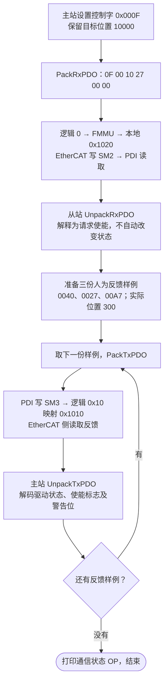

# 第十课：控制字发请求，状态字报结果

第九课已完课并归档为 `lesson-09`，保留你的目标 10000、本地 Rx 地址 0x1020，以及第九课第 10 节的排错经验。第十课开始版本是 `lesson-10-start`，目前学习中。

这一课先解释 PDO 中已有的控制字和状态字。达到“能分清请求与反馈、能判断反馈状态、能跑通一个修改练习”即可。先读 main 中「第十课从这里开始」的四步，再逐步看小模块；不用立即独立写状态机。

## 1. 通信通了以后，还要知道驱动处于什么状态

EtherCAT 的 INIT、PRE-OP、SAFE-OP、OP 管通信准备与数据有效性。CiA402 是驱动设备的应用规范，用控制字请求动作，用状态字报告驱动状态。

通信处于 OP，并不能单独证明驱动已经 Operation Enabled。主站还要读取驱动反馈；后续执行运动时，还要核对操作模式、目标有效性和本地保护条件。本课仅解释数据，不控制真实电机。

例如：主站发出“请求使能”，反馈仍是 Switch On Disabled。程序应报告“请求已收到，但反馈未使能”，不能凭发过命令就假定成功。

## 2. 两个对象，其实早已在我们的 PDO 里

| 对象 | 类型 | 方向 | 当前 PDO 位置 | 含义 |
|---|---|---|---|---|
| 0x6040:00 Controlword，控制字 | 16 位无符号 | 主站 → 从站，RxPDO | 偏移 0–1 | 请求驱动执行什么 |
| 0x6041:00 Statusword，状态字 | 16 位无符号 | 从站 → 主站，TxPDO | 偏移 0–1 | 驱动现在报告什么 |

前几课把它们保持为 0，只观察位置；现在开始解释它们。PDO 长度仍是 6 字节：前两字节是字，后四字节是位置。

对象索引是身份，不是每笔 PDO 都附带的字节，也不是 ESC 本地地址。第十课继续通过固定 PDO 访问这两个字段；原 OD / SDO 模块目前只支持两个 INTEGER32 位置对象，尚未扩展到 16 位对象访问。

核对依据：[Synapticon 官方 Controlword 定义](https://doc.synapticon.com/node/sw5.6/objects_html/6xxx/6040.html)、[官方 Statusword 状态编码](https://doc.synapticon.com/node/sw5.6/objects_html/6xxx/6041.html)。本课独立编写教学代码，没有复制第三方驱动实现。

## 3. 先认识三个控制字

| 命令样例 | 值 | 低四位 bit3…bit0 | 先怎样理解 |
|---|---|---|---|
| Shutdown | 0x0006 | 0110 | 请求转换到 Ready To Switch On，需结合当前状态 |
| Switch On | 0x0007 | 0111 | 请求进入 Switched On |
| Enable Operation | 0x000F | 1111 | 请求使能运行 |

名字 Shutdown 指驱动状态命令，不是退出 C 程序。以上只是清楚易读的基础值；实际命令允许部分不关心位和模式位，效果取决于当前驱动状态及转换条件。第十一课再实现转换逻辑，本课只解释请求。

控制字中先关注这些位：

| 位 | 含义 |
|---|---|
| bit0 | Switch On |
| bit1 | Enable Voltage |
| bit2 | Quick Stop 相关命令位；本课正常使能样例取 1 |
| bit3 | Enable Operation |
| bit7 | Fault Reset，故障复位请求 |

故障复位的边沿、不同当前状态的响应、模式专用位稍后展开，不把单个位直接视为完整动作。

代码中的 `CIA402_ControlRequestsEnableOperation` 用 `0x008F` 保留 bit7、bit3～0，判断基本请求是否为 0x000F。即使返回 true，也只说明“请求了使能”。

## 4. 先看三份反馈

主站发出同一个 0x000F 请求后，我们人为提供三份状态字样例：

| 状态字 | 解码结果 | 已使能运行？ | 有警告？ |
|---|---|---|---|
| 0x0040 | Switch On Disabled | 否 | 否 |
| 0x0027 | Operation Enabled | 是 | 否 |
| 0x00A7 | Operation Enabled | 是 | 是 |

这些反馈由课堂选定，**不是根据控制字自动产生的状态转换**。当前代码没有驱动状态机、电机模型或实际使能动作。

0x0027 是用于识别状态的基础编码样例；真实报告可能同时带电压、远程、模式等标志，例如 0x0037 也可解码为 Operation Enabled。状态字中的电压位不在本课状态识别掩码内，不能从基础编码样例推断真实供电情况。

## 5. 为什么不能直接比较整个状态字

警告位是 bit7，对应 0x0080。给 0x0027 加上警告：

```c
0x0027 | 0x0080   /* 得到 0x00A7；| 是按位或。 */
```

0x00A7 和 0x0027 不相等，但它们都报告 Operation Enabled。判断该状态时，保留决定状态的位再比较：

```c
(statusword & 0x006F) == 0x0027
```

`&` 是按位与。掩码为 1 的位保留，为 0 的位忽略：

```text
0x006F = 0110 1111
         保留 bit6、bit5、bit3～0；忽略 bit4 与更高标志位

0x00A7 & 0x006F = 0x0027
```

也不能只看状态字 bit2：Quick Stop Active 的基础编码 0x0007 也包含 bit2，但不是 Operation Enabled。完整状态编码才能区分它们。

新模块能识别八种标准状态，未识别组合返回 UNKNOWN，不猜作已使能。有些状态需要 0x004F 掩码而非 0x006F，具体转换关系留到第十一课；先把这三个反馈样例看懂。

## 6. 程序运行流程图

main 先完成第六至九课，再执行以下第十课演示。沿用你的目标 10000、本地 Rx 地址 0x1020、反馈 300；控制字与状态字都经过原 PDO 路径。



配置来自已经执行的第九课；第十课复用它们，不新建一套地址。三份反馈逐份发布和读取，单线程顺序执行，没有实时循环。

## 7. 编译运行

保存修改后，在 Project_L 根目录执行：

```powershell
.\EtherCAT_Slave_Simulator\build.ps1
```

末尾新增输出：

```text
Lesson 10: CiA402 Controlword / Statusword basics
Control commands: Shutdown=0x0006, SwitchOn=0x0007, EnableOperation=0x000F
CiA402 RxPDO: 0F 00 10 27 00 00
Slave controlword=0x000F, requests_enable_operation=1
CiA402 TxPDO: 40 00 2C 01 00 00
Master statusword=0x0040, drive_state=SWITCH_ON_DISABLED, operation_enabled=0, warning=0
CiA402 TxPDO: 27 00 2C 01 00 00
Master statusword=0x0027, drive_state=OPERATION_ENABLED, operation_enabled=1, warning=0
CiA402 TxPDO: A7 00 2C 01 00 00
Master statusword=0x00A7, drive_state=OPERATION_ENABLED, operation_enabled=1, warning=1
Communication state=OP; feedback samples are supplied by the lesson.
```

`operation_enabled` 是对收到的状态字的解码结果，不是电机运动或安全许可的实测证明。`warning` 单独显示，不会因此将驱动状态改为 Fault；后续应用如何处理具体警告，要结合实际故障和保护策略。

前两字节按小端传输：0x000F → `0F 00`，0x0027 → `27 00`。数值 0x6040 是对象索引，不会打包成 `40 60` 代替控制字。

## 8. 代码只需先抓住这几个入口

| 入口 | 做什么 |
|---|---|
| main 的第十课四步 | 设置控制字、传输、准备样例、逐份读反馈 |
| CiA402/cia402.h | 三个命令常量及状态枚举 |
| CIA402_ControlRequestsEnableOperation | 判断控制字是否请求使能 |
| CIA402_DecodeStatusword | 将状态字的位组合解释为驱动状态 |
| CIA402_IsOperationEnabled | 判断反馈是否解码为 Operation Enabled |

枚举是给状态编码取可读的名字。这里的 `switch` 只是识别收到的位组合，不是根据当前状态和命令推进下一状态。第十一课再加真正的状态更新逻辑。

main 中 `status_samples` 是三份输入样例；`sizeof 数组 / sizeof 一项` 算出项数；for 循环每次处理一份。`lesson10_status | CIA402_SW_WARNING` 给第三份样例置警告位；不会修改第二份样例。

## 9. 一个小练习及答案

只改这一行，将 0x0027 改成 0x0023：

```c
uint16_t lesson10_status = 0x0027;
```

预测后再编译运行。参考答案：

- 第一份仍为 0x0040，Switch On Disabled，operation_enabled=0。
- 第二份变为 0x0023，Switched On，operation_enabled=0。
- 第三份变为 0x00A3，Switched On，operation_enabled=0，warning=1。
- 主站仍发 0x000F，requests_enable_operation 仍为 1；请求与反馈可以不同。
- 目标仍 10000，实际位置仍 300，地址与 PDO 长度不因状态字数值改变。

可选练习：把控制字赋值改成 `CIA402_CW_SWITCH_ON`，预测 Rx 前两字节为 `07 00`，请求使能判断为 0；课堂反馈样例仍来自数组，不能期待它们自动随命令变化。

## 10. 思考题与参考答案

- 为什么 0x00A7 还能是 Operation Enabled？它比 0x0027 多了警告位；决定驱动状态的位组合未变，掩码后仍为 0x0027。
- 收到状态字 0x0007，bit2 是 1，能否当作已使能？不能，完整编码报告 Quick Stop Active。
- 发出 0x000F 却读到 0x0040，程序是不是出错？单凭这两个值不能认定。命令表达请求，反馈表达报告；本课刻意展示二者独立，真实设备还要看转换条件和后续反馈。
- 第九课的 FMMU/SM 能识别这些位的电机含义吗？它们负责地址与数据交接，驱动含义由应用层 CiA402 代码解释。

本课只识别命令与反馈。第十一课学习驱动状态机，根据“当前状态 + 命令 + 条件”更新状态并产生状态字；电机模式和运动控制继续后移。

## 验证说明

严格编译运行和 Windows PowerShell 5.1 / PowerShell 7 构建已通过。独立验证 tests/verify_lesson10.c 覆盖八种状态、额外电压/远程/模式/警告位、未知组合、Quick Stop 和故障不误报使能、请求与反馈独立，以及 PDO 字节布局。第十课练习尚未记录为学习者完成。

若想复现测试，先运行 build.ps1 创建 build 目录，再在项目根目录执行：

```powershell
$testArguments = @(
    '-std=c11', '-Wall', '-Wextra', '-Wpedantic', '-Werror'
    'EtherCAT_Slave_Simulator/tests/verify_lesson10.c'
    'EtherCAT_Slave_Simulator/CiA402/cia402.c'
    'EtherCAT_Slave_Simulator/EtherCAT/ethercat_pdo.c'
    '-o', 'EtherCAT_Slave_Simulator/build/verify_lesson10.exe'
)
& gcc @testArguments
if ($LASTEXITCODE -ne 0) { throw 'Verification compilation failed' }
& .\EtherCAT_Slave_Simulator\build\verify_lesson10.exe
if ($LASTEXITCODE -ne 0) { throw 'Verification failed' }
```
