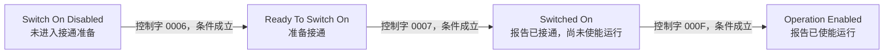
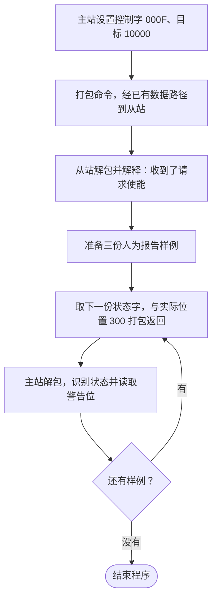

# 第十课补讲：先理解请求与反馈，再看位操作

补讲日期：2026-10-05。学习者确认 STM32F407 + LAN9252 从站板已到货，有原理图和部分源码。补讲时第十课仍在学习中，本次补讲不增加新代码；同日学习者随后请求开始第十一课，完课结果见第十课主讲义。

后续安排更新：学习者已选择先完成原来的软件课程，暂缓开发板实操。下面第 1 节保留当时讨论的硬件路线，供日后恢复硬件学习时参考；当前只沿纯 C 模拟器主线学习。

## 1. 现在怎样安排软件与硬件学习

建议继续当前课程，同时开始硬件通信入门。先把本课的请求与反馈讲清，随后按板卡实际出厂配置验证一套配套 IO 例程：主站发现设备、读取身份与状态，再观察主站控制 LED、从站反馈按键。

硬件实验不要求先学完所有 CiA402。普通 IO 通信可以先帮助你看见 PDO 数据流，之后再把相同路径中的变量换成驱动控制字和状态字。开发板到货不意味着现有固件就是 CiA402 驱动，也不代表电机功率级已具备；具体功能按例程、对象表与实际板卡核对。

资料入口见[商家资料阅读指南](../docs/商家资料阅读指南.md)。先确认出厂 PDI 和固件，使用与其匹配的 ESI/EEPROM；不把本教学模拟器的 6 字节 PDO 或地址配置直接套到硬件上。

当前只有“板卡到货”的用户确认，没有新增真实从站通信、电机动作或实时性验收。

## 2. 为什么已经会传目标位置，还需要 CiA402

设主站希望关节到达位置 10000。仅收到目标值，从站仍需要知道：驱动是否完成初始化？是否允许进入运行？当前应按位置、速度还是转矩目标处理？若有故障，怎样报告和复位？

CiA402 是驱动与运动控制设备的一组标准约定：规定常用对象、驱动状态、控制请求及运行模式等，让主站与驱动能按一致的含义交换数据。它不是某个 C 函数或某颗芯片，也不直接替你实现位置环、FOC、PWM 或电流采样。[CiA 官方概述](https://www.can-cia.org/can-knowledge/cia-402-series-canopen-device-profile-for-drives-and-motion-control)

结合本项目理解：

| 层次 | 先回答什么问题 |
|---|---|
| EtherCAT 通信 | 主站和从站怎样交换数据，通信是否就绪？ |
| PDO / SDO 与对象字典 | 哪些变量被交换或访问，布局和身份是什么？ |
| CiA402 应用约定 | 控制字请求什么，状态字报告什么，驱动按什么模式运行？ |
| 电机控制与功率硬件 | 怎样实际产生运动，并测量反馈？ |

这些层次共同工作。主站能通信与驱动允许运行是两件需要分别确认的事。

## 3. 两种状态不要混在一起

EtherCAT 的 INIT、PRE-OP、SAFE-OP、OP 是通信状态。本课中的 state 变量保存它。

CiA402 的 Switch On Disabled、Ready To Switch On、Switched On、Operation Enabled 等是驱动状态。本课通过解码状态字得到 drive_state。

因此：通信 state = OP，同时驱动报告 Switch On Disabled，是可以出现的组合。前者表示已经进入运行通信状态，后者表示驱动还没有报告使能运行。OP 不能代替驱动状态、模式及本地保护条件。

## 4. 控制字和状态字，就是请求与报告

主站提出“请进入运行”，这是控制字。驱动报告“我目前是什么状态”，这是状态字。

| 字段 | 对象身份 | 谁产生 | 谁读取 |
|---|---|---|---|
| 控制字 Controlword | 0x6040:00 | 主站 | 从站驱动应用 |
| 状态字 Statusword | 0x6041:00 | 从站驱动应用 | 主站 |

二者都是 16 位数，但每个位的含义不同。发出请求后，驱动需要结合当前状态及内部条件处理，主站再读反馈；请求成功与否不能只看发出去的值。[控制字定义](https://doc.synapticon.com/node/sw5.6/objects_html/6xxx/6040.html)、[状态字定义](https://doc.synapticon.com/node/sw5.6/objects_html/6xxx/6041.html)

“收到目标位置 10000”“收到请求使能”“驱动报告已使能”“实际位置已到 10000”也是四个不同事实。当前教学代码只有前三项的数据演示，实际位置始终是人为设定的 300，没有电机运动。

## 5. 先认识正常使能路径

下面只描述常见的正常路径，条件成立才转换；故障、快速停止和其他分支以后再展开：



这张图用于理解驱动如何逐步准备，**当前第十课程序没有实现这三次转换**。真正的状态机下一课再写。

| 命令样例 | 低四位 | 在上述路径中的请求 |
|---|---|---|
| 0x0006，Shutdown | 0110 | 准备接通 |
| 0x0007，Switch On | 0111 | 接通 |
| 0x000F，Enable Operation | 1111 | 使能运行 |

Shutdown 在这里是驱动命令名，不等于关闭程序。Switch On 命令在别的当前状态可能有别的转换作用；上述表只讲这条正常路径。

## 6. 0x000F 为什么叫请求使能

它的低四位是 1111。由 bit0 到 bit3，控制字分别有 Switch On、Enable Voltage、Quick Stop 相关命令位、Enable Operation。

```text
位号       bit3  bit2  bit1  bit0
0x000F       1     1     1     1
```

Quick Stop 相关位在本例正常命令中取 1，不是在此请求快速停止；不要仅凭位名认为“写 1 就快速停止”。这些是标准规定的命令位组合，不是我们随意选择的编号。

本课函数 CIA402_ControlRequestsEnableOperation 用 0x008F 检查基本命令位，返回 true 只说明收到的是请求使能命令。这个函数没有改变驱动状态。

## 7. 状态字为何用掩码，而不是整个数相等

本课反馈 0x0027 表示 Operation Enabled 的基础状态编码。0x00A7 比它多警告位 0x0080，仍可报告相同的驱动状态。警告与故障是不同标志，具体警告在后续应用中另行处理。

判断 Operation Enabled 时，按状态编码保留 bit6、bit5、bit3～0，忽略电压及其他不决定该状态的标志位：

```c
(statusword & 0x006F) == 0x0027
```

把 & 看成一个逐位筛选器：

```text
状态字 0x00A7： 1010 0111
掩码   0x006F： 0110 1111
按位与结果：    0010 0111 = 0x0027
```

因此 0x0027 和 0x00A7 都能判断为 Operation Enabled；第三份的 warning 单独为 1。

0x0027 是用于演示的基础编码，真实状态字可以带电压等标志，例如 0x0037。只解释状态编码不能替代电压测量、真实运动或保护验收。其他驱动状态有些使用 0x004F，本课暂时不用背全部掩码。

也不能只看 bit2 是否为 1：状态字 0x0007 中 bit2 为 1，却解码为 Quick Stop Active。要检查完整状态组合。

## 8. 第十课代码实际做了什么

第九课已留下目标 10000 和实际位置 300。第十课再进行以下四步：

1. master_command.controlword 设置为 0x000F。
2. 控制字与目标一起经过原 PDO/FMMU/SM/PDI 路径，从站解包到 slave_command。打印请求使能标志 1。
3. 人为准备三份状态报告：0x0040、0x0027、0x00A7。
4. 每份状态字与实际位置 300 打包并传回，主站解码状态和警告。

最容易误解的是第 3 步：

```c
uint16_t lesson10_status = 0x0027;
const uint16_t status_samples[] = {
    0x0040,
    lesson10_status,
    (uint16_t)(lesson10_status | CIA402_SW_WARNING)
};
```

数组就是人为提供的三份输入样例。它们不是“驱动收了 0x000F 后自动走过的三个状态”，也不是“随机生成的真实反馈”。我们在练习读懂报告。



| 反馈样例 | 主站解码的状态 | operation_enabled | warning |
|---|---|---|---|
| 0x0040 | Switch On Disabled | 0 | 0 |
| 0x0027 | Operation Enabled | 1 | 0 |
| 0x00A7 | Operation Enabled | 1 | 1 |

第一份就是刻意展示“收到了使能请求，但此份报告尚未使能”。后两份练习“同一状态可以附带不同标志”。

## 9. 六字节怎样读

本课的命令：

```text
0F 00 | 10 27 00 00
控制字  | 目标位置 10000
```

本课的一份反馈：

```text
27 00 | 2C 01 00 00
状态字  | 实际位置 300
```

控制字与状态字虽然都在 PDO 的前两字节，方向和含义不同。0x6040 是对象身份，而 0x000F 是这个对象本次的值；不能用 `40 60` 代替 `0F 00` 发送控制命令。

## 10. 这次只做一个最小观察

先运行现有代码，不急着修改：

```powershell
.\EtherCAT_Slave_Simulator\build.ps1
```

读末尾四个事实：请求使能是 1，第一份反馈使能是 0，第二份是 1，第三份是 1 且警告为 1。先用自己的话解释为什么它们不矛盾。

理解后再做原练习：把 lesson10_status 从 0x0027 改为 0x0023，保存并重新编译运行。后两份变为 Switched On，operation_enabled 都是 0，第三份仍带警告；主站请求仍是使能。这个结果再次说明请求不会自动改写我们人为设置的报告样例。

本课先抓住请求、反馈、掩码三个概念，再逐步看底层函数。C 指针、完整八状态与商家 cia402appl.c 不必同时展开阅读。
