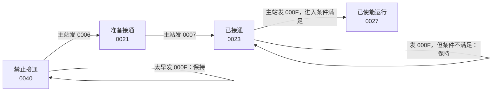
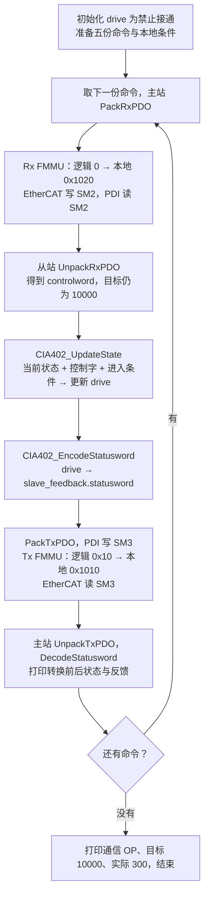

# 第十一课：CiA402 状态机，第一步——正常使能路径

2026-10-05 开始，开始版本为 `lesson-11-start`。学习者随后请求下一节，第一小节成果归档为 `lesson-11-part1`；整个第十一课仍未完课。第十课已归档为 `lesson-10`，保留你把状态样例改成 `0x0023` 的成果。

继续纯 C 软件课程，暂缓开发板。下文保留第一小节的四个正常状态与当时范围；当前累计代码已经增加[第二步：快速停止](Lesson_11_第二步_快速停止.md)及[第三步：故障与复位](Lesson_11_第三步_故障与复位.md)，分小步阅读即可，不用一次记住整张状态机。

## 1. 本课多做了哪件事

第十课：主站发出请求，但报告是我们手工准备的 `0040 / 0023 / 00A3`；程序只解释报告。

第十一课：从站应用记住当前状态，根据收到的请求判断能否转换，再生成状态字报告。前面第十课代码继续保留；新的演示在 main 最后，打印 `Lesson 11, part 1` 后开始。

```text
当前驱动状态 + 收到的控制字 + 本地进入条件
                    ↓
             判断并更新驱动状态
                    ↓
         生成状态字 → TxPDO → 主站解码
```

状态机就是“记住现在在哪里，再按规则决定下一步去哪里”。没有对应转换时，就停在原状态。它不会因为调用了一次函数就自动前进一步。

## 2. 先看四个状态

| 内部状态 | 中文理解 | 本课生成的状态字 |
|---|---|---|
| SWITCH_ON_DISABLED | 禁止接通，正常使能的起点 | `0x0040` |
| READY_TO_SWITCH_ON | 已准备接通 | `0x0021` |
| SWITCHED_ON | 已接通，尚未使能运行 | `0x0023` |
| OPERATION_ENABLED | 已使能运行 | `0x0027` |

本课假定内部初始化已完成，从 SWITCH_ON_DISABLED 开始；NOT_READY_TO_SWITCH_ON 的初始化过程尚未实现。这些是软件状态名称，程序没有控制电源或电机。

状态字表只生成决定状态的最小编码，未加入电压、远程、警告等附加标志；实际设备可能反馈 `0x0037` 等数字，仍需按第十课的掩码解码。状态位和附加标志的定义见厂商[0x6041 文档](https://doc.synapticon.com/node/sw5.6/objects_html/6xxx/6041.html)。



箭头上是主站的**请求**，框里的数字是从站的**反馈**。不能把 `0x000F` 直接复制到状态字。

`0x0006` 的命令名称是 Shutdown，不要仅凭英文理解成“从任何状态都关机”。从禁止接通状态，它让驱动进入准备接通；从已接通或已使能状态，它可以退回准备接通。命令的作用要结合当前状态看。

标准还允许在 READY_TO_SWITCH_ON 收到 `0x000F` 时执行“接通并使能”的组合转换，经过接通功能后进入使能；本模型条件不满足时只进入 SWITCHED_ON。上图是本次主演示路径，不是所有合法路径。命令及转换编号见厂商[0x6040 文档](https://doc.synapticon.com/node/sw5.6/objects_html/6xxx/6040.html)。

## 3. 程序这次具体做什么

先运行已有命令：

```powershell
.\EtherCAT_Slave_Simulator\build.ps1
```

保存修改后运行它，会重新编译并执行。终端前面仍是第六至第十课；本次重点看最后五行 Step。

| 步骤 | 收到的控制字 | 进入条件 | 转换后的状态 | 反馈 |
|---|---|---|---|---|
| 初始 | 尚未处理本课命令 | — | 禁止接通 | `0040` |
| 1 | `000F` | 满足 | 禁止接通：请求太早 | `0040` |
| 2 | `0006` | 满足 | 准备接通 | `0021` |
| 3 | `0007` | 满足 | 已接通 | `0023` |
| 4 | `000F` | 不满足 | 已接通：保持原状态 | `0023` |
| 5 | `000F` | 满足 | 已使能运行 | `0027` |

第 1 步条件满足也不能跳过准备状态；第 4 步状态已经到位，但进入条件未满足。两者说明：只看控制字都不够。

这里 `condition` 是从站应用本地的模拟输入，不是主站通过 PDO 发来的字段。`true` 表示本次允许进入使能状态，`false` 表示暂时不允许。它只模拟“进入条件”，没有实现运行中的保护监督；已经使能后把这个值改为 false，并不会自动触发故障或停机。

初始行只打印本地初始状态，没有声称完成一次 PDO 交换。随后五步每次都完成一次请求与反馈交换：



每个数据搬运函数和状态更新函数都会检查返回值，异常时 main 返回 1；图展示正常执行路径。它是单线程顺序演示，五次调用不代表真实 1 ms 循环。

## 4. 新代码先读这些

先打开 [main.c](main.c)，搜索 `第十一课第一步`，找到：

```c
CIA402_DriveState drive = CIA402_SWITCH_ON_DISABLED;
bool lesson11_enable_condition = true;
```

第一行创建一个变量，记录“当前驱动状态”。`CIA402_DriveState` 是第十课已有的枚举类型；可以先把它理解为能保存这些状态名称的类型。第二行是修改练习的开关。

接着只读循环第 2 步这两个调用：

```c
CIA402_UpdateState(&drive, slave_command.controlword,
                   enable_steps[i].enable_condition_met);
CIA402_EncodeStatusword(drive, &slave_feedback.statusword);
```

- `&drive`：把变量地址交给函数，允许函数修改原来的 drive。
- `slave_command.controlword`：从 PDO 解包出来的请求。
- `enable_steps[i].enable_condition_met`：本次从站本地条件。
- 第一个函数更新状态；第二个函数把状态编码成状态字。
- `&slave_feedback.statusword`：让编码函数能把结果写到这个字段。

main 中实际用 `if` 检查两个函数是否返回成功，上面省略检查只是便于看清参数。`UpdateState` 返回 true 表示本小节支持这次输入，不承诺状态改变；第 1、4 步都返回 true，同时保持原状态。

最后打开 [cia402_state.c](CiA402/cia402_state.c)，先读这个分支：

```c
case CIA402_SWITCHED_ON:
    if (shutdown) {
        *state = CIA402_READY_TO_SWITCH_ON;
    } else if (enable_operation && enable_condition_met) {
        *state = CIA402_OPERATION_ENABLED;
    }
    break;
```

`case` 表示“当前是已接通，就执行这一段”。`&&` 表示两个条件都要满足。`*state = ...` 是通过地址修改调用者的状态变量。若两条判断都不成立，就没有赋值，因此状态保持不变。`break` 结束这个分支，不执行后面的 case。

在 C 中，地址 `&drive` 和通过地址访问 `*state` 是一组关系。此处的 `*` 是访问指针指向的变量，不是乘法。你先能结合这一处解释即可，不需要现在掌握所有指针用法。

代码里的 `condition ? A : B` 是“条件为真选 A，否则选 B”；它只用于组合命令分支，理解主路径时可以稍后再读。

## 5. 完整范围与退回分支

以下分支已经实现并单独验证，本次先知道它们存在，不要求同时记住：

| 当前状态 | 命令 | 结果 |
|---|---|---|
| 已使能运行 | `0007`，Disable Operation | 退回已接通 |
| 已接通或已使能运行 | `0006`，Shutdown | 退回准备接通 |
| 四个正常状态 | `0000`，Disable Voltage 的一种编码 | 回到禁止接通 |
| 准备接通 | `000F`，组合请求 | 条件满足则使能，否则只接通 |

命令按位识别，不是整字比较：Shutdown 忽略 bit3，Disable Voltage 要求 bit7 为 0、bit1 为 0。因此 `000E` 也可表示 Shutdown，`0005` 也符合 Disable Voltage；不能凭“没在常用数字表里”认定它无效。普通命令忽略不决定转换的模式位。

本小节拒绝快速停止、故障复位及未实现的状态，返回 false 并保留原状态；不假装完成这些分支。主示例只发送已支持的命令。现有对象字典仍只支持两个 INTEGER32 位置对象，没有新增 16 位 SDO 接口。

EtherCAT 的 OP 表示本例通信状态；CiA402 的 OPERATION_ENABLED 表示驱动运行状态。主示例前四步通信一直为 OP，而驱动一直未使能。实际位置始终为 300，使能不会让它自动变成目标 10000；电机运动模型还没实现。

## 6. 只做一个修改练习

在 main.c 搜索 `lesson11_enable_condition`，只把声明改为：

```c
bool lesson11_enable_condition = false;
```

先预测：第 5 步还会到 OPERATION_ENABLED 吗？状态字是多少？目标与实际位置会改变吗？再保存并运行 build.ps1。

**参考答案：** 第 1～4 步不变；第 5 步收到 `000F`，但进入条件为 false，所以保持 SWITCHED_ON，反馈 `0023`，operation_enabled=0。目标仍为 10000，实际仍为 300，通信仍为 OP。请求已经送到，从站应用决定暂不进入运行。

思考题与答案：

1. 第 1 步和第 5 步控制字相同，为什么结果不同？——当前状态不同：禁止接通不能直接响应使能；已接通且进入条件满足时可以使能。
2. 为什么第 4 步返回 true，operation_enabled 却为 0？——输入属于本小节支持的命令，但本地进入条件未满足，处理成功不等于转换成功。
3. 为什么保留独立的状态字编码函数？——内部状态用于作决策，状态字用于传输；编码函数明确两者对应关系，主站再解码收到的报告。

能够解释五步输出并完成这个单值练习，就达到本小节目标。你不必现在自己写完整状态机；后续再逐步加入快速停止与故障路径。

## 7. 验证与版本记录

第一小节完成时，学习者已将 `lesson11_enable_condition` 改为 false，严格编译运行通过：第 5 步反馈为 `0x0023`，operation_enabled=0；目标仍为 10000，实际仍为 300。上方 true 示例保留为开始版本对照，当前累计工程保留学习者的 false 修改。

本节测试源在 [verify_lesson11.c](tests/verify_lesson11.c)，可先跳过。关键运行结果及实际验证记录见 [学习记录](../docs/学习记录.md)。生成的 exe 和练习验证临时文件仅放在忽略的 build 目录，不上传。`lesson-11-start` 固定保存开始版本，`lesson-11-part1` 固定保存本小节成果；整个第十一课仍在学习中。
