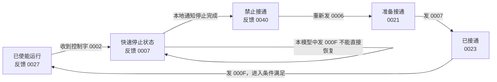
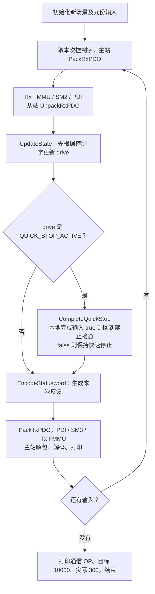

# 第十一课第二步：快速停止——请求与完成是两件事

开始版本为 `lesson-11-part2-start`。学习者请求下一节后，本小节归档为 `lesson-11-part2`；目前整个第十一课已归档为 `lesson-11`。上一小节成果为 `lesson-11-part1`，保留你把进入条件改为 false 的练习。

继续纯 C 模拟器。本次只增加一个驱动状态 QUICK_STOP_ACTIVE，以及一个从站本地“停止完成”事件；故障和复位留到下一小节。

下文保留第二小节归档版本的范围；当前累计代码已增加[第三步：故障与复位](Lesson_11_第三步_故障与复位.md)。

## 1. 先理解新增的状态

上一小节是“如何进入正常运行”。本小节看“运行过程中收到快速停止请求后怎么办”。

| 内容 | 本课使用的数字或名称 | 谁产生 |
|---|---|---|
| 快速停止请求 | 控制字 `0x0002` | 主站，通过 RxPDO 发送 |
| 正在执行快速停止路径 | QUICK_STOP_ACTIVE，最小状态编码 `0x0007` | 从站，生成后通过 TxPDO 报告 |
| 停止完成事件 | `stop_completed = true` | 从站本地逻辑；本课手动模拟 |

**收到停止请求，不等于停止过程已经完成。** 程序先进入快速停止状态；完成条件还没到，就保持这个状态。

特别注意：控制字 `0x0007` 是普通接通/禁止运行的命令，状态字 `0x0007` 则表示 QUICK_STOP_ACTIVE。数字相同，字段和含义不同。控制字与状态字仍分别采用第十课的[0x6040 命令定义](https://doc.synapticon.com/node/sw5.6/objects_html/6xxx/6040.html)和[0x6041 状态编码](https://doc.synapticon.com/node/sw5.6/objects_html/6xxx/6041.html)。

## 2. 本课选一条停止路径

真实驱动的快速停止行为受 `0x605A Quick Stop Option Code` 配置影响。本模型固定选择 **2：按快速停止减速路径停止，完成后回到 SWITCH_ON_DISABLED**。其他选项可能有不同的停后状态，例如 6 会停留在 QUICK_STOP_ACTIVE；本课不实现这些选项。定义见[厂商 0x605A 文档](https://doc.synapticon.com/node/sw5.6/objects_html/6xxx/605a.html)。



本课没有速度变量或减速轨迹，只模拟上述状态转换与事件顺序；actual_position 仍为 300，不能据此声称实际电机已经减速。`0x605A` 也未加入现有对象字典或 SDO，选择 2 是代码中固定的教学假设。

## 3. 运行并看九步结果

保存文件后，在项目根目录运行：

```powershell
.\EtherCAT_Slave_Simulator\build.ps1
```

最后的 `Lesson 11, part 2` 是新演示。它从禁止接通重新开始，进入条件固定为 true，与第一小节独立；第一小节的 false 练习继续保留，两个场景不会互相覆盖。

| Stop step | 控制字 | 本次停止完成输入 | 本次反馈状态 | 状态字 |
|---|---|---|---|---|
| 1 | `0006` | false | 准备接通 | `0021` |
| 2 | `0007` | false | 已接通 | `0023` |
| 3 | `000F` | false | 已使能运行 | `0027` |
| 4 | `0002` | false | 快速停止状态 | `0007` |
| 5 | `000F` | false | 保持快速停止状态 | `0007` |
| 6 | `0002` | true | 禁止接通 | `0040` |
| 7 | `0006` | false | 准备接通 | `0021` |
| 8 | `0007` | false | 已接通 | `0023` |
| 9 | `000F` | false | 已使能运行 | `0027` |

先看第 4～6 步，前后三步只是正常使能路径的复习。

- 第 4 步：收到快速停止请求，状态转换到 QUICK_STOP_ACTIVE。
- 第 5 步：收到使能请求，但没有停止完成事件。本模型保持快速停止状态。
- 第 6 步：先处理重复的快速停止请求，再处理本地完成事件，转换到禁止接通。

第 6 步回到禁止接通，原因是本地事件 true；重复发送 `0002` 本身不会表示“已经停完”。停止完成输入是每一步的本地事件，不是 PDO 字段，也不是整个程序一直保持为 true 的标志。第 7 步以后不在快速停止状态，完成事件函数不会被调用。

## 4. 程序运行顺序



图展示正常路径；代码会检查数据路径和状态函数的返回值，异常时退出。这是九次顺序调用，没有新增实时周期。

## 5. 新代码只先看两处

在 [cia402_state.c](CiA402/cia402_state.c) 中，已使能状态新增：

```c
if (quick_stop) {
    *state = CIA402_QUICK_STOP_ACTIVE;
}
```

意思是“当前正在正常运行，又收到快速停止请求，就记录快速停止状态”。这里没有直接记录停止完成。

新增函数 `CIA402_CompleteQuickStop` 的核心是：

```c
if (stop_completed) {
    *state = CIA402_SWITCH_ON_DISABLED;
}
```

函数先确认当前是快速停止状态，然后才判断完成条件。`*state` 仍是通过地址修改调用者的状态变量；false 时没有赋值，就保留原状态。返回 true 表示这个事件输入已处理，仍不承诺发生转换。

在 [main.c](main.c) 搜索 `第十一课第二步`，循环第 2 步按这三个动作执行：处理命令 → 处理快速停止完成事件 → 编码状态字。你先理解它们的先后顺序即可，不要求独立重写整个循环。

## 6. 只改一个值的练习

找到 main 中这一行：

```c
bool lesson11_stop_completed = true;
```

改成 false，模拟一直没有通知停止完成。先预测第 6～9 步，再保存、重新运行 build.ps1。

**参考答案：** 第 1～5 步不变。第 6 步保持 QUICK_STOP_ACTIVE，状态字 `0007`；第 7、8、9 步虽然收到 `0006 / 0007 / 000F`，本模型仍保持 QUICK_STOP_ACTIVE，反馈均为 `0007`，operation_enabled=0。通信仍为 OP，目标仍为 10000，实际仍为 300。

思考题与答案：

1. `0007` 的 bit2 也是 1，为什么 operation_enabled=0？——要解码完整状态，QUICK_STOP_ACTIVE 与 OPERATION_ENABLED 不同，不能只看 bit2。
2. 停止完成会自动使能吗？——本模型完成后只回到禁止接通；后面要走准备、接通、使能请求。
3. 快速停止会让 EtherCAT 自动离开 OP 吗？——本程序只更新驱动状态，通信状态没有变化；两套状态机分开管理。
4. 从未使能的准备接通或已接通状态收到快速停止，会怎样？——本模型回到禁止接通；已经禁止接通则保持，只有已使能状态走进入 QUICK_STOP_ACTIVE 的分支。

## 7. 范围与回顾

目前实现四个正常状态和快速停止状态，支持停止完成事件、Disable Voltage 退回，以及停止后重新使能。本模型快速停止状态收到 Disable Voltage 也能回到禁止接通；正常演示选用等待完成事件的路径。

故障反应、故障、故障复位仍未实现。不模拟真实 ESC、驱动硬件、停止时间或实时控制。本节测试在 [verify_lesson11_part2.c](tests/verify_lesson11_part2.c)，已有正常路径测试也随当前范围调整并保留；关键结果见[学习记录](../docs/学习记录.md)。

本节开始版本固定为 `lesson-11-part2-start`，成果版本为 `lesson-11-part2`。归档时重新严格编译运行通过：停止完成条件仍为 true，第 6 步回到禁止接通，第 9 步重新使能。false 修改是可选练习，未记录为学习者已完成。下文范围指本小节归档版本，下一小节加入故障与复位。
