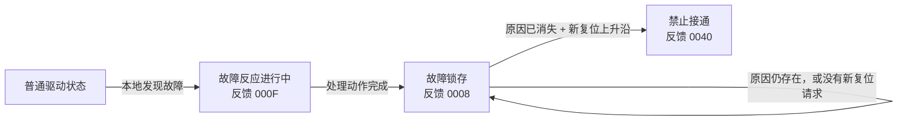
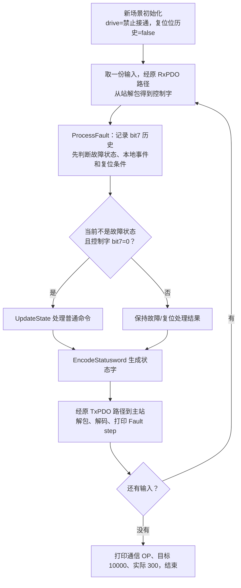

# 第十一课第三步：故障与复位

开始版本：`lesson-11-part3-start`。学习者随后表示本阶段可以结束并要求一次生成后续课程，第十一课按本课教学范围归档为 `lesson-11`。前两小节成果为 `lesson-11-part1`、`lesson-11-part2`。继续纯 C 软件资料路线，暂缓开发板。

本节先理解三件事：故障处理完成、故障原因消失、收到新的复位请求。它们不是同一个条件。

## 1. 增加两个状态

| 状态 | 中文理解 | 本课生成的最小状态字 |
|---|---|---|
| FAULT_REACTION_ACTIVE | 正在执行故障处理动作 | `0x000F` |
| FAULT | 故障处理动作已完成，故障仍被锁存 | `0x0008` |
| SWITCH_ON_DISABLED | 复位后的禁止接通状态 | `0x0040` |

例如，应用检测到故障，先进入 FAULT_REACTION_ACTIVE；处理动作完成后进入 FAULT。故障原因消失并收到有效复位请求后，才能回到禁止接通。这条路径见 [STOBER CiA402 手册，第 84 页](https://www.stober.jp/manual/manual-commissioning-instruction-cia402-443080-01-en.pdf#page=84)。



这里的 `000F` 是**状态字**，表示故障反应；之前的 `000F` 是**控制字**，表示请求使能。数值相同不能当作含义相同。状态码沿用[0x6041 的位编码](https://doc.synapticon.com/node/sw5.6/objects_html/6xxx/6041.html)。

## 2. 分清两个从站本地条件

- `fault_active`：故障原因现在是否仍存在，输出中叫 `cause`。
- `reaction_completed`：故障处理动作是否完成，输出中叫 `reaction_done`。

例如：程序完成了故障处理动作，但导致故障的原因仍在。此时 reaction_done=1、cause=1，可以进入 FAULT，却不能复位。反过来，原因已经消失，也不意味着处理动作已经完成。

“故障锁存”表示程序会记住故障：把 cause 改成 0，并不会自动退出 FAULT。主站还要明确发出一次有效复位请求。软件 FAULT 状态与 cause 这个输入不能混为一谈。

本课手工提供这些事件，没有真正检测电流、温度或执行硬件保护，也没有新增错误码对象、故障日志或保护动作配置。

## 3. 为什么复位要看上升沿

Fault Reset 使用控制字 bit7。常用值 `0x0080` 就是将这个位置 1。一次有效请求看的是 bit7 **从 0 变成 1**，称为上升沿；复位后应把该位放回 0。厂商的具体说明见 [Zaber 控制字手册](https://www.zaber.com/protocol-manual?protocol=CANopen)。

```text
复位位：0 → 1 → 1 → 1 → 0 → 1
新请求：    有   无   无   无   有
```

一直发送 `0080`，只会产生最开始那次上升沿。如果当时故障原因尚未消失，本模型不保存这次请求等以后再执行。原因消失后，需要先发 bit7=0 的控制字，再置 1。

因此新增了一个历史变量 `previous_reset_bit`：记录上次收到的 bit7。它在循环外初始化一次，循环内每步更新，不能每次调用前都清零。

控制字 bit7 表示复位请求；状态字 bit7 表示警告。它们位号相同，却属于不同对象。不能拿状态字警告位充当复位命令。

## 4. 先运行，看三个小段

在项目根目录保存并运行：

```powershell
.\EtherCAT_Slave_Simulator\build.ps1
```

末尾 `Lesson 11, part 3` 是新场景，从禁止接通开始，进入条件固定 true。第一小节 false、第二小节 true 的变量继续保留，不被本节覆盖。

| Fault step | 控制字 | cause | reaction_done | 新复位沿 | 结果与状态字 |
|---|---|---|---|---|---|
| 1～3 | `0006 → 0007 → 000F` | 0 | 0 | 无 | 正常使能，最后为 `0027` |
| 4 | `000F` | 1 | 0 | 无 | 故障优先，进入故障反应 `000F` |
| 5 | `0080` | 1 | 0 | 有 | 本模型在反应阶段不复位，保持 `000F` |
| 6 | `0000` | 1 | 1 | 无 | 处理完成，进入 FAULT `0008` |
| 7 | `0080` | 1 | 0 | 有 | 原因仍在，保持 FAULT `0008` |
| 8 | `0080` | 0 | 0 | 无 | 原因消失但没有新请求，仍为 `0008` |
| 9 | `0000` | 0 | 0 | 无 | 放低复位位，仍为 `0008` |
| 10 | `0080` | 0 | 0 | 有 | 满足条件，复位到禁止接通 `0040` |
| 11 | `0080` | 0 | 0 | 无 | 重复高位，不自动使能，仍为 `0040` |
| 12～14 | `0006 → 0007 → 000F` | 0 | 0 | 无 | 重新使能，最后为 `0027` |

先看第 4～6 步，理解“反应 → 锁存”；再看第 7～10 步，理解“原因与新请求”；最后看第 11～14 步，理解“复位不是使能”。

第 6、9 步的 `0000` 在普通状态可以表示 Disable Voltage，但在故障状态不会绕过故障锁存。程序先处理故障，只有当前不处于故障状态才调用普通命令函数。

## 5. 程序执行顺序



只在本节独立场景中，每步优先调用故障模块；前两小节仍按原流程演示。原 FMMU / SM / PDI 地址、PDO 长度和位置数据不变。所有函数检查返回值，图展示正常路径。

## 6. C 代码先看这两处

打开 [cia402_fault.c](../CiA402/cia402_fault.c)，先读上升沿判断：

```c
bool reset_bit = (controlword & CIA402_CW_FAULT_RESET) != 0u;
bool reset_rising = reset_bit && !*previous_reset_bit;
*previous_reset_bit = reset_bit;
```

第一行取出本次 bit7。第二行要求“本次为 1，之前为 0”：`&&` 表示两个条件都满足，`!` 表示取反。第三行通过指针把本次值保存成历史，供下次调用使用。要先算上升沿，再保存历史，否则就丢掉了上次的值。

然后读 FAULT 分支：

```c
if (reset_rising && !fault_active) {
    *state = CIA402_SWITCH_ON_DISABLED;
}
```

它表达“只有新请求，并且故障原因已经消失，才退出锁存故障”。`*state` 的作用与前两小节相同：修改调用者的状态变量。

在 [main.c](../main.c) 搜索 `第十一课第三步`。重点读循环第 2、3 步，先理解 ProcessFault 在 UpdateState 前执行。故障反应阶段、FAULT 阶段不执行普通命令；复位帧也不会在同一轮顺便执行普通使能。

## 7. 只改一个值的练习

找到：

```c
bool lesson11_fault_cleared = true;
```

改成 false，模拟故障原因始终没有消失。先预测第 10 步能否复位、第 14 步能否重新运行，再保存并执行 build.ps1。

**参考答案：** 第 1～7 步不变；第 8 步起 cause 一直为 1。第 10 步有新复位沿也不能复位，第 14 步普通使能也不能退出 FAULT。第 7～14 步都保持 FAULT，状态字 `0008`，operation_enabled=0；通信仍为 OP，目标仍为 10000，实际仍为 300。

思考题与答案：

1. 为什么第 8 步原因消失，却还处于故障？——故障已锁存，而且 `0080` 一直为高，没有新的复位沿。
2. 为什么第 6 步处理完成，原因却还为 1？——完成处理动作与消除原因是两个条件，本模型分别输入。
3. 为什么成功复位后不是 OPERATION_ENABLED？——复位回到禁止接通，普通使能请求必须随后执行。
4. 为什么每次调用前不能把 previous_reset_bit 清为 false？——这样每次高位都被误判为新上升沿，可能追认之前失败的请求。

## 8. 本课范围与版本

本模型优先处理故障，先报告 FAULT_REACTION_ACTIVE，后续轮次再接受处理完成事件。反应阶段不缓存提前复位，原因仍在时不接受复位，失败请求不会在原因消失后自动执行；真实设备应依据自己的手册判断支持行为。

累计代码现在能生成七种状态的最小编码；NOT_READY_TO_SWITCH_ON 初始化过程仍未实现，不宣称已经实现完整 CiA402。快速停止仍固定为 Option Code 2，未实现真实故障检测、保护动作、错误码字典、运行模式、电机或实时循环。

第三步测试在 [verify_lesson11_part3.c](../tests/verify_lesson11_part3.c)，可先跳过实现；验证及关键结果见[学习记录](../../docs/学习记录.md)。`lesson-11-part3-start` 保存开始版本，`lesson-11` 保存完课版本。归档时原因消失条件仍为 true，严格编译运行通过；不将 false 可选练习记为学习者已完成。
