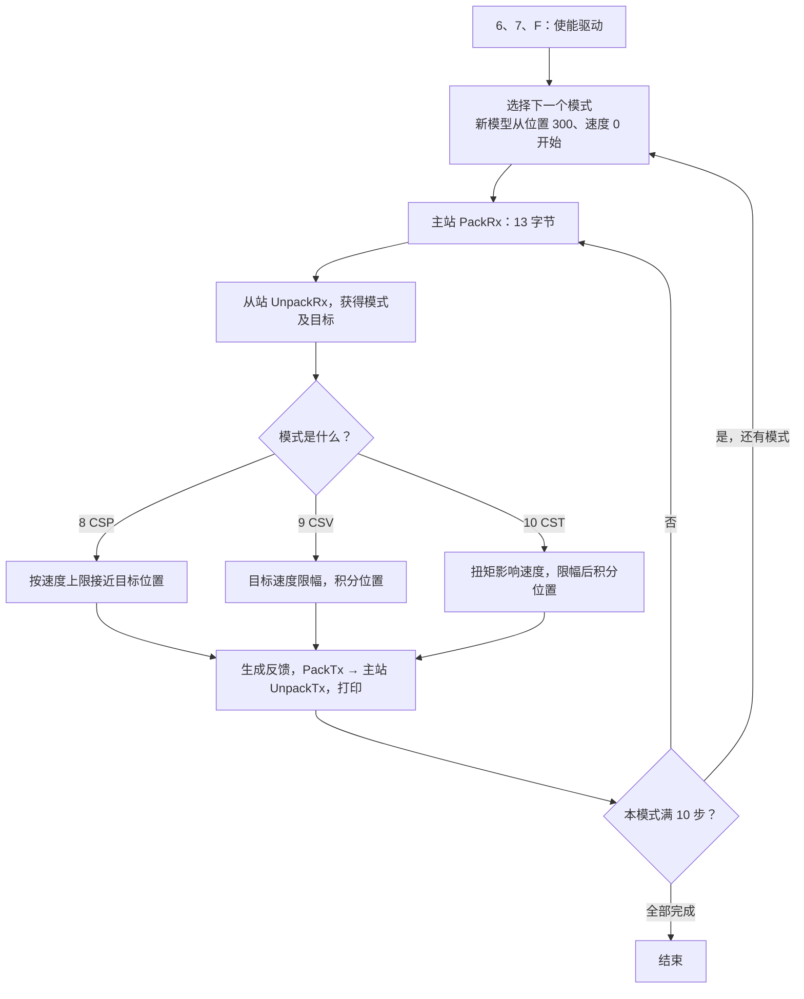

# 第十二课：位置、速度、扭矩模式

资料与参考实现已生成，等待独立学习，不代表学习者已完课。开始版本 `lesson-12-start`。这课单独运行，原第六至十一课的 main 与所有练习保留。

## 1. 三种请求有什么不同

CiA402 的 0x6060 请求运行模式，0x6061 反馈实际接受的模式。这里选用周期同步模式 CSP=8、CSV=9、CST=10；它们与 Profile Position=1 等轮廓模式不同，不能混用握手规则。编号及请求/反馈区别见[厂商 0x6060 文档](https://doc.synapticon.com/node/sw5.6/objects_html/6xxx/6060.html)。

| 模式 | 请求量 | 本模型如何处理 | 本模型主要反馈 |
|---|---|---|---|
| CSP，位置 | 目标位置 | 限制每步移动量，逐步靠近目标，不越过目标 | 实际位置 |
| CSV，速度 | 目标速度 | 限幅后作为速度，按时间积分成位置 | 实际速度与位置 |
| CST，扭矩 | 目标扭矩 | 用教学比例把输入转换为加速度，再积分速度与位置 | 模拟扭矩、速度、位置 |

共同前提是驱动已经使能。使能决定“能否执行”，模式决定“执行哪种目标”。本课不实现 FOC、实际电流环、DC 同步或轨迹插补；CSP 在这里采用简化限速位置模型，不是实际驱动器算法。

位置单位是模拟计数，速度是计数/秒。扭矩是教学整数输入：假定加速度=扭矩输入×1000 计数/秒²。没有额定扭矩与传感器标定，不将这些整数当成真实 mNm。实际设备的对象单位和缩放应查其手册。

## 2. 运行方法

从项目根目录执行：

```powershell
.\EtherCAT_Slave_Simulator\build_further.ps1 -Lesson 12
```

它编译 Further_Lessons/lesson12.c，不改旧 build.ps1。输出三个独立场景，各从实际位置 300、速度 0 开始，逻辑步长 1 ms，每个场景 10 步。逻辑步长只是计算输入，程序会直接执行，没有保证真实毫秒调度。

## 3. 新的固定 PDO 布局

原课程每方向 6 字节继续保留。新示例每方向 13 字节，前 6 字节复用原编解码，后面增加模式、速度、扭矩。

| 偏移 | RxPDO 内容 | 对象 | TxPDO 内容 | 对象 | 长度 |
|---|---|---|---|---|---|
| 0～1 | 控制字 | 6040 | 状态字 | 6041 | 2 |
| 2～5 | 目标位置 | 607A | 实际位置 | 6064 | 4 |
| 6 | 请求模式 | 6060 | 模式显示 | 6061 | 1 |
| 7～10 | 目标速度 | 60FF | 实际速度 | 606C | 4 |
| 11～12 | 目标扭矩 | 6071 | 实际扭矩 | 6077 | 2 |

对象编号表示字段语义，未扩展旧对象字典/SDO 接口，也未写入实际 0x1600/0x1A00 映射。新例子只演示应用变量与 PDO 字节交换，不连接旧的固定 6 字节 SM；迁移硬件时映射、SM 长度、ESI 和主站配置需要一致。

不能直接 sizeof(结构体) 作为长度；对齐填充可能使它超过 13。代码显式打包小端字节，接收端检查精确长度。负数先在宽类型还原，避开越界的有符号转换。

## 4. 程序运行流程



参数、长度、模式或位置范围异常时返回失败，示例退出；图展示有效输入的正常路径。

先看 [lesson12.c](../Further_Lessons/lesson12.c) 的两个循环：外层选模式、内层执行 10 次。`Joint_Step` 负责运动模型，PDO 函数负责字节，不负责电机决策。

## 5. 怎样理解输出

| 场景 | 关键输出 | 原因 |
|---|---|---|
| CSP 第 1 步 | 位置 400，速度 100000 | 100000 计数/秒 × 0.001 秒=100 计数 |
| CSP 第 7 步 | 位置 1000 | 到达默认目标 |
| CSP 第 8～10 步 | 位置 1000，速度 0 | 后续步不再移动 |
| CSV 第 1 步 | 整数位置仍 300，速度 500 | 内部已移动 0.5 计数，整数反馈截断小数 |
| CSV 第 2 步 | 位置 301 | 两步累计 1 个计数 |
| CSV 第 10 步 | 位置 305，速度 500 | 总移动 5 计数 |
| CST 第 10 步 | 位置 305，速度 1000，扭矩 100 | 半隐式积分，速度每步增加 100，累计位移 5.5 计数 |

CSP 报告的是本步平均速度，所以第 7 步刚到达目标仍报告 100000；下一步才为 0。CST 的公式是特意简化的教学假设，不能据此宣称实现了真实扭矩闭环。

速度积分不能每次先把 0.5 转成整数 0，否则永远看不到移动。`position_milli` 用千分之一计数保存余量；最后反馈才转换为整数。int64_t 中间值及范围检查防止 int32_t 位置溢出；速度有本地限幅。

## 6. 修改练习与答案

打开 lesson12.c，把 `lesson12_target_position` 从 1000 改成 500，再重新构建。

答案：CSP 第 1 步到 400，第 2 步到 500，后续保持 500；CSV 与 CST 不使用目标位置来决定运动，因此其独立场景输出不变。旧 main 的目标 10000 不受影响。

思考：把使能条件传成 false 会怎样？——有效模式仍可接受，位置保持，速度和扭矩为 0。本模型把停用动作简化为立即停止，不模拟真实惯性或制动。

思考：请求模式改成 7 会怎样？——模型不支持，Joint_Step 返回 false，不改原运动状态。第十三课会把无效模式作为本地故障输入处理。

## 7. 已验证与范围

严格 C11 编译运行和 tests/verify_further.c 通过：13 字节收发、符号边界、错误长度保留输出、CSP 不越过目标、CSV 小数累计、CST 限幅、未使能不移动、位置越界不写回。关键结果见[学习记录](../../docs/学习记录.md)。

本课资料已生成，待你独立阅读或练习；不要把参考代码存在当成自己已经掌握。下一课把模式模型放入带超时保护的周期流程。
