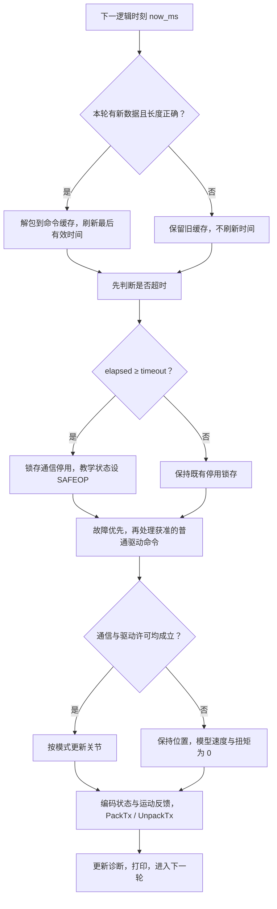

# 第十三课：周期任务、看门狗与诊断

原交接规划最后一节编号软件课。资料与参考实现已生成，待独立学习；开始版本 `lesson-13-start`。本程序模拟逻辑 1 ms 周期，不声称已经实现真实 1 ms 实时任务。

## 1. 把已学模块放进一轮周期

每轮：接收新 PDO → 检查长度 → 更新超时判断 → 处理 CiA402 故障/命令 → 判断运动许可 → 更新关节 → 发布反馈 → 统计诊断。

看门狗必须在运动之前检查。否则在超时轮次先动一下再停，就与“超时当轮禁止运动”的目标不符。

允许运动需要同时满足：通信为 OP、没有通信停用锁存、驱动为 OPERATION_ENABLED、模式受支持。本示例未加入实际功率驱动或硬件保护条件。



## 2. 运行

```powershell
.\EtherCAT_Slave_Simulator\build_further.ps1 -Lesson 13
```

一次运行两课可用 `-Lesson All`。本程序独立使用第十二课的 13 字节 PDO 字节交换，复用现有通信状态、CiA402 和关节模型。不连接真实网络或原固定 6 字节 SM，不配置真实 FMMU/SM，也不处理 WKC、DC 同步或完整帧校验。

逻辑时刻是 0～12 ms，每步直接 now_ms 加 1，没有 Sleep。需要的目标是先理解时序与失联策略，不是用桌面运行速度证明实时性能。

## 3. 看门狗怎么算

```text
elapsed = now_ms - last_valid_ms
elapsed >= timeout_ms：超时
```

本例 timeout=3 ms。启动时把 last_valid_ms 设为启动时刻，给一个等待窗口。只有本轮确实收到且通过长度检查的新 PDO 才刷新时间；再次读旧数组、长度错误、无新包都不能刷新。

先接收、后检查：新数据在本轮检查前到达时，时间已经刷新，不算超时。这是本示例明确选择的轮内顺序，真实设备应按自身到达时间与截止期限判定。

now_ms 必须是单调计数时间，不能使用可能跳变的系统日期。无符号相减能处理一次 uint32_t 回绕，前提是调用间隔短且时钟单调；timeout 限制在 1～2^31-1。

## 4. 为什么恢复数据后仍然停止

程序区分两个量：

- `expired`：当前数据是否超时，新包到来后可以变成 false。
- `communication_stop_latched`：应用曾因失联停用，一旦置位，本演示不自动清除。

因此 t=7 虽收到新包、expired=0，latched 仍为 1。通信保持 SAFEOP，普通驱动状态被设为禁止接通，位置保持。若已经有故障反应或 FAULT，则保留故障，不能通过超时逻辑清掉故障锁存。

这里直接赋教学通信状态，因为旧 EC_RequestState 不支持 OP→SAFEOP 向下转换；这不是实际 ESC AL 状态机行为的完整实现。真实恢复应包括通信配置/过程数据检查、目标与实际位置对齐、明确恢复请求和逐步使能。本演示没有恢复接口，避免把“报文恢复”当作“自动重启”。

在超时前的短暂丢包，模型保持最后目标继续更新；超时当轮立即禁止位置更新。停用时把模拟速度和扭矩清零是教学假设，没有模拟惯性或制动过程。

## 5. 预期输出

| 时刻 | 输入情况 | 看门狗/停用 | 位置与状态 |
|---|---|---|---|
| 0、1 | 0006、0007 | 正常 | 位置 300，未使能 |
| 2、3 | 000F | 正常 | 位置 400、500 |
| 4、5 | 无新数据 | 距最后有效数据 1、2 ms | 保持旧目标，位置 600、700 |
| 6 | 无新数据 | 3 ms，触发超时 | SAFEOP、禁止接通，位置保持 700 |
| 7、8 | 新数据恢复 | expired=0，但 latched=1 | 仍保持 700 |
| 9 | 错误长度 12 字节 | 拒绝、不刷新 | 仍保持 700 |
| 10～12 | 新数据 | 停用锁存仍在 | 仍保持 700 |

诊断输出为：

```text
Diagnostics: accepted=9, missing=3, rejected=1, watchdog_trips=1, published=13
```

accepted 是长度检查接受的过程数据，rejected 是到达但被拒绝的数据，missing 是没有新数据的轮次。trips 只统计第一次锁存停用，不把持续超时的每一轮都当作新故障。published 表示本软件生成了 13 次反馈，不代表真实网卡发送成功。

长度通过只表示本程序约定的数据布局通过，不证明整个 EtherCAT 帧正确。若模式不受支持，即使其 PDO 长度通过，仍作为本地故障原因；接收健康与应用命令合法性分开判断。

## 6. 阅读代码的小顺序

打开 [lesson13.c](../Further_Lessons/lesson13.c)，先读四个中文步骤；再看 allow_motion 的几个 `&&` 条件；最后看 [watchdog.c](../Further_Lessons/watchdog.c) 的 elapsed 比较。

这里的 cached 是最后一份已接受的命令。缺数据时保留它，不等于该轮收到了新命令。`before_position` 用来验证：未获运动许可的轮次，位置没有被修改，速度和扭矩为零。

## 7. 修改练习与答案

把 lesson13.c 的 `lesson13_timeout_ms` 从 3 改成 5，保存并重编译。

答案：t=4～6 的最大间隔是 3 ms，还不到 5 ms；t=7 的新数据刷新时间，所以本次场景不超时。watchdog_trips=0、latched=0，通信保持 OP，最后位置为 1000。其余统计仍为 accepted=9、missing=3、rejected=1、published=13。

思考：能不能每个循环都刷新 last_valid_ms？——不能，程序循环正常不等于通信正常，旧缓存会掩盖失联。

思考：为什么 SAFEOP 和 OPERATION_ENABLED 两个条件都要检查？——通信允许过程输出与驱动允许运行是两套状态，任何一方不满足都不允许模型运动。

思考：参数 dt_ms=1 是否说明硬件每毫秒执行？——不说明。这只是模型积分步长，真实周期需要测量执行时间、抖动和最坏延迟。

## 8. 真正的 1 ms 需要验证什么

记录周期开始时间、工作执行时长、相邻周期间隔、最大抖动、超期次数。通信、驱动计算、反馈搬运必须有可测量的时间预算；日志不能阻塞关键周期。DC/Sync0、硬件定时器和操作系统调度要根据真实平台选择。

本课没有使用 Windows Sleep 去伪装实时，也没有实测 1 ms 指标。FreeRTOS 迁移架构见[附录 A](../../docs/后续课程_附录A_FreeRTOS架构.md)；开发板资料路线见[附录 B](../../docs/后续课程_附录B_STM32与LAN9252迁移.md)，均为后续参考。

## 9. 验证与课程结束

本模型、看门狗边界/回绕与错误参数测试、前一课运动/PDO 测试已通过。整体场景核对超时当轮不动、包恢复不自动使能、错误长度不喂狗；5 ms 练习答案也有临时副本验证。

本课是原编号软件课程的终点，资料生成完成不代表硬件项目完成。你可以到此结束这次教学，后续按[结课导航](../../docs/软件课程结课导航.md)自主回顾。
