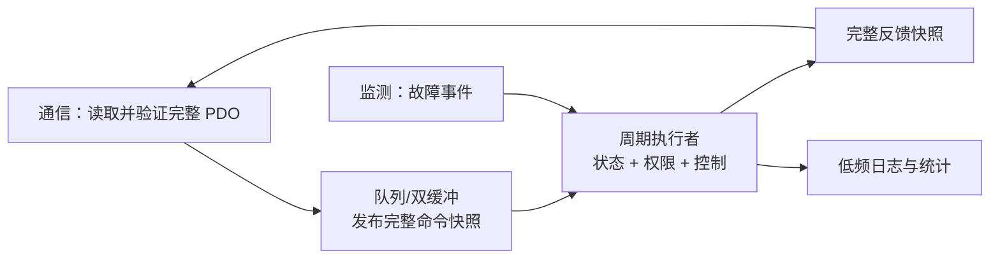

# 附录 A：把软件周期迁移到 FreeRTOS

架构学习资料已生成，未运行 FreeRTOS、未生成 MCU 工程或烧录。它对应原交接文档 V9 阶段，不是新编号课程的完课记录。现在无需动开发板。

## 1. 先保留一轮周期函数

第十三课按顺序更新接收、时间检查、状态、关节和反馈。迁移时先提取这轮工作，底层接口改为真实 ESC/PDI 读写；不要因为引入 RTOS 就立即把每个函数拆成一个任务。

建议先明确谁拥有可变状态：驱动状态与运动状态由一个周期执行者修改；其他任务通过完整命令/事件传递信息，避免同时写同一个状态变量。

| 角色 | 工作 | 交给周期执行者的内容 |
|---|---|---|
| 通信任务/事件 | PDI 数据读写、Mailbox 服务 | 一份完整新命令及接收时间/序号 |
| 周期执行者 | 状态、权限、控制输出、反馈快照 | 拥有状态与运动输出 |
| 监测任务 | 故障条件、统计 | 故障原因事件，不直接改 drive |
| 日志任务 | 低频读取统计并输出 | 不阻塞关键周期 |

更高频的电流环是否运行在中断/专用控制任务，要按电机控制方案决定，不能直接把桌面 Joint_Step 当成 FOC。

## 2. 稳定快照比 volatile 更重要



选择队列、双缓冲或有界临界区时，明确完整快照何时可读。序号用于区分新命令与旧缓存。`volatile` 不能保证多字段一致性，也不能代替锁或完整发布机制。

仅保留最新命令的队列适合某些周期目标，不适合必须逐个处理的 Mailbox 请求。故障/停止事件也要定义优先级，不能无意被最新目标覆盖。

## 3. 周期唤醒与实时验证

FreeRTOS 的 xTaskDelayUntil 使用固定参考时刻安排周期唤醒，适合学习周期任务的基础；普通相对延时会把工作执行时间加进间隔。接口与例子见[官方 API](https://www.freertos.org/Documentation/02-Kernel/04-API-references/02-Task-control/03-xTaskDelayUntil)和[官方 task.h](https://github.com/FreeRTOS/FreeRTOS-Kernel/blob/main/include/task.h)。

RTOS tick 的粒度取决于配置。即使某个等待参数等于一个 tick，也不能直接宣称真实任务严格 1 ms；任务就绪还受到优先级、中断和其他工作影响。更精确唤醒可能来自硬件定时器或 DC/Sync0 事件，需结合平台验证。

以下是架构伪代码，**不参与构建，未执行**：

```text
每次周期事件到来：
    获取接收时间和完整新命令
    检查超时和故障
    更新状态与运动许可
    执行已验证的控制算法
    发布完整反馈快照
    记录执行时长与超期计数
```

中断里只做必要的确认/通知和短操作；不要把 printf、长时间总线等待或 Mailbox 大量处理塞进高频中断。具体拆分应由时序测量决定，不预设某个固定任务数能满足需求。

## 4. 练习与参考答案

问题：通信任务写了新控制字，但目标位置还是上一轮，周期任务此时读取会怎样？——可能执行一份从未真实接收到的混合命令；应发布完整快照，而不是逐字段让读者观察中间状态。

问题：日志任务优先级很低就一定不会拖慢周期吗？——不一定。共享锁、阻塞 IO、总线资源竞争仍可能影响关键路径；要控制共享资源持有时间并测量最坏延迟。

问题：看门狗应该看任务循环次数还是接收时间？——通信看门狗应看有效新数据时间；任务自身健康监测另设指标，二者不能混淆。

阅读完能画清状态拥有者、快照传递和周期唤醒来源即可。本附录没有声称已经验证任何板上调度、线程安全实现或实时性能。
