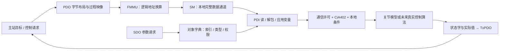
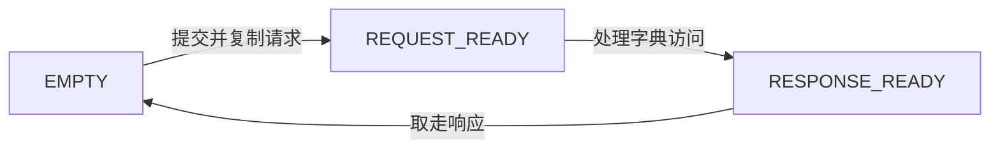
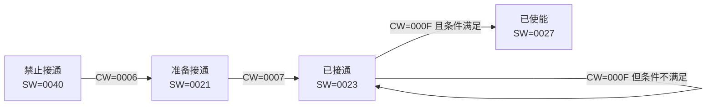

# EtherCAT 全课程复习总结

整理日期：2026-10-05。用途：在一个文件中回顾第 1～13 课，并把知识转换成可以解释、演示和应对面试追问的内容。

第一至第五课为已有理论学习；第六至十一课已归档；第十二、十三课资料和参考实现已生成，待独立学习。软件学习阶段结束，硬件与真实实时性仍未验收。下文分别说明协议概念和本工程实际实现。

## 目录

1. [项目与整体链路](#review-project)
2. [第 1～5 课：架构、报文、地址与通信状态](#review-architecture)
3. [第 6 课：PDO 与过程映像](#review-pdo)
4. [第 7～8 课：字典、Mailbox、CoE 与 SDO](#review-sdo)
5. [第 9 课：FMMU、SM、PDI](#review-mapping)
6. [第 10～11 课：CiA402](#review-cia402)
7. [第 12 课：模式与关节模型](#review-modes)
8. [第 13 课：周期、看门狗与诊断](#review-watchdog)
9. [C 实现、构建与排错](#review-c)
10. [迁移与求职复习](#review-job)

<a id="review-project"></a>

## 一、项目与整体链路

本项目用于理解“主站想做什么，从站如何理解，为什么可能拒绝，如何把当前状态报告回来”。当前主站角色和从站角色在一个普通 C 程序里按顺序执行。



这张图汇总层次关系。累计 main 展示到第十一课；第十二、十三课是独立示例，没有把 13 字节 PDO 接入旧六字节 SM，也没有连接真实 ESC。

真实设备中，PC 主站组织以太网帧；ESC 在总线上处理访问，MCU 通过 PDI 搬运本地过程数据并运行协议栈/应用。LAN9252 是 ESC，STM32 是应用 MCU，两者职责不同。产品依据见 [Microchip LAN9252](https://www.microchip.com/en-us/product/lan9252)。

<a id="review-architecture"></a>

## 二、第 1～5 课：架构、报文、地址与通信状态

### 1. 为什么学习 EtherCAT

机器人关节需要周期地接收目标、输出反馈，并处理多设备同步与异常。EtherCAT 的通信机制面向这类需求；是否满足具体周期仍由整套系统配置和测量证明。

当前这条直接二层 EtherCAT 链路使用 EtherType `0x88A4`，无需给从站设置 IP。SOEM 是主站库，Npcap 是 Windows 网卡访问组件，Wireshark 是观察工具。工程没有用 TCP/UDP 请求来代替 EtherCAT 帧。

### 2. Frame 和 Datagram

概念顺序是以太网头 → EtherCAT 头 → 一个或多个 Datagram → 以太网 FCS。Datagram 包含命令、标识、四字节地址字段、长度/标志、事件字段、数据和 WKC。当前 C 模拟器没有实现这层完整报文解析。

WKC 是成功访问的工作计数，必须结合命令和配置与期望值比较，不能直接当作从站数量或运动完成标志。常见读/写命令成功贡献 +1；读写命令的读成功 +1、写成功 +2。依据见 [Beckhoff 报文与 WKC](https://infosys.beckhoff.com/content/1033/tc3_io_intro/1257993099.html)。

### 3. 寻址

| 类型 | 命令例子 | 回答“访问谁/哪里” |
|---|---|---|
| 自动增量 | APRD / APWR | 启动发现时按拓扑位置寻找设备 |
| 配置站地址 | FPRD / FPWR | 访问已分配站地址的设备寄存器/本地区 |
| 广播 | BRD / BWR | 对所有符合规则的设备执行操作 |
| 逻辑 | LRD / LWR / LRW | 按统一过程数据地址，由各从站 FMMU 映射 |

对象索引 `0x607A`、ESC 本地地址 `0x1020`、主站逻辑地址 `0` 是三种不同身份；C 指针又是第四种地址，不能相互直接代换。

### 4. ESC 里面有什么

理解四个角色：DPRAM 保存数据；FMMU 负责地址映射；SyncManager 负责受规则约束的一致数据交换；PDI 连接本地应用。Mailbox 服务通常由协议栈利用相关通道实现，不把所有高层服务都当成 ESC 自动完成。

工程的 SM 是顺序调用的字节数组复制模型，表达完整数据与访问方向；它没有实现硬件多缓冲、真实事件、中断或并发线程安全。

### 5. EtherCAT 通信状态

| 状态 | 主要理解 | 注意 |
|---|---|---|
| INIT | 初始化 | 尚无正常 Mailbox / 过程数据通信 |
| PRE-OP | 参数与 Mailbox | 为过程数据配置做准备 |
| SAFE-OP | 输入过程数据可周期更新，输出保持设备规定的安全状态 | 不能理解为完全没有 PDO；具体行为受设备配置影响 |
| OP | 正常过程数据与输出通信 | 不等于驱动已经使能 |

这是常规学习路径，另有可选 BOOT 等行为。本地 `EC_RequestState` 只实现简化上行和回 INIT，不能称完整 AL 状态机。标准概念见 [Beckhoff 状态机](https://infosys.beckhoff.com/content/1033/el15xx/1036980875.html)。

遇到不能进 OP，未来实机要查 AL 状态/错误、SM/PDO 长度、有效输出数据和同步要求；在本模型中先看函数支持的路径与返回值。

<a id="review-pdo"></a>

## 三、第 6 课：PDO 与过程映像

### 1. 方向以从站为参照

RxPDO：从站收到，主站输出；TxPDO：从站发送，主站输入。Process Image 是主站应用组织过程数据的缓冲区，并不是另一种对象字典。

### 2. 六字节布局

| 偏移 | RxPDO | TxPDO | 类型 |
|---|---|---|---|
| 0～1 | 控制字 6040 | 状态字 6041 | uint16_t |
| 2～5 | 目标位置 607A | 实际位置 6064 | int32_t |

每方向 16+32=48 bit=6 字节。显式打包保持固定偏移、小端顺序，避免结构体填充及本机字节序影响。

学习者第六课把目标改为 2000、反馈改为 300：

```text
Rx：00 00 D0 07 00 00   // 2000 = 0x000007D0
Tx：00 00 2C 01 00 00   // 300  = 0x0000012C
```

这时控制/状态字为零，不能从这个最初例子判断使能。目标改变也不表示真实电机已运动。

### 3. Mapping 和 Assignment

Mapping 描述每个 PDO 的字段身份与位宽；例如映射项 `0x607A0020` 表示索引 607A、子索引 00、长度 0x20=32 bit。Assignment 决定向通道分配哪些 PDO。实际配置可能使用 1600/1A00 等映射对象及 1C12/1C13 分配对象，设备支持范围与权限需确认。结构关系参考 [Beckhoff 映射说明](https://infosys.beckhoff.com/content/1033/el6695/1317558667.html)。

本工程按固定字节布局处理，没有向对象字典加入实际可重配置的 Mapping/Assignment 对象，不支持动态 PDO 映射。

<a id="review-sdo"></a>

## 四、第 7～8 课：字典、Mailbox、CoE 与 SDO

### 1. 对象字典

对象身份是索引 + 子索引；条目还包含类型、权限和存储位置。本工程最初只有两个 INTEGER32 条目：607A:00 目标 RW，6064:00 实际值 RO。

字典条目保存应用变量的指针。PDO 解包更新目标变量后，字典读到同一变量；SDO 写也更新它，不必另维护一份“SDO 目标”。指针指向的变量必须在字典使用期间仍有效。

RO 约束的是外部写入接口，实际反馈仍可由应用/传感器更新。查不到、权限不符、空参数要返回相应结果，不应悄悄写入。

### 2. Mailbox、CoE、SDO 的关系

理解路径：SDO 参数服务 → CoE 内容 → Mailbox 消息 → ESC 邮箱通道 → EtherCAT 访问。SDO 按对象身份访问，PDO 按事先约定的过程数据布局周期交换；两条路径可以访问同一应用变量。

本工程分两步：先模拟请求/响应结构体，再编码八字节快速 SDO 内容。没有外层 CoE/Mailbox 消息头，没有完整帧收发、分段、Complete Access、超时重试或真实协议栈。

### 3. 单事务邮箱



不能把“请求已放进邮箱”当成“对象已写成功”。邮箱忙时拒绝另一请求，以免覆盖未完成事务。过程数据通常关心最新完整值，参数请求则通常关心每一笔响应。

### 4. Upload 与 Download

Upload：从站上传给主站，是主站读。Download：主站下载给从站，是主站写。方向用对象所在设备来理解，不凭英文猜。

### 5. 八字节 SDO 内容

| 偏移 | 内容 |
|---|---|
| 0 | 命令字 |
| 1～2 | 索引，小端 |
| 3 | 子索引 |
| 4～7 | 四字节数值或 Abort Code |

| 命令 | 本实现解释 |
|---|---|
| 40 | Upload 请求 |
| 23 | Download，显式四字节快速数据 |
| 43 | Upload 成功，显式四字节数据 |
| 60 | Download 成功确认 |
| 80 | Abort |

写 607A:00=7000：`23 7A 60 00 58 1B 00 00`。成功确认：`60 7A 60 00 00 00 00 00`。读同一对象：请求 `40 7A 60 00 00 00 00 00`，响应 `43 7A 60 00 58 1B 00 00`。

不要只看数据四字节：要核对响应类型及索引/子索引。`EC_SDO_GetUploadI32` 失败时不修改调用者的接收值。

### 6. Abort 与函数返回值

| 代码 | 本工程对应错误 |
|---|---|
| 05040001 | 不支持的命令 |
| 06010002 | 写只读对象 |
| 06020000 | 对象不存在 |
| 06070010 | 类型/长度不匹配 |
| 06090011 | 子索引不存在 |
| 08000000 | 一般错误 |

本地处理函数返回 true 可以表示“已生成响应”，响应可能是 Abort；服务成功要再看响应。错误码本身也小端编码，例如 06010002 是 `02 00 01 06`。

<a id="review-mapping"></a>

## 五、第 9 课：FMMU、SM、PDI

### 1. 职责

FMMU 先验证映射启用、方向和整个逻辑区间，再计算本地地址。SM 再验证本地地址/长度/读写来源，复制一份完整数据。应用通过 PDI 读字节、解包才获得新目标，FMMU 不会直接给 C 变量赋值。

本模型地址公式：

```text
physical = physical_start + (logical_address - logical_start)
```

先检查范围再相减，避免无符号下溢；还要防止地址和长度相加溢出。真实 FMMU 支持更细的位映射，本模型只有整字节连续映射。

### 2. 当前保存的地址与结果

| 数据 | 逻辑范围 | ESC 本地范围 | 通道/方向 |
|---|---|---|---|
| Rx 命令 | 0～5 | 1020～1025 | SM2：EtherCAT 写、PDI 读 |
| Tx 反馈 | 10～15（十六进制） | 1010～1015 | SM3：PDI 写、EtherCAT 读 |

目标 10000 的完整路径：PackRx → 逻辑 0 换算 1020 → SM2 完整发布 → PDI 读 → 解包 → 字典读到 10000。实际值仍为 300，经 SM3/FMMU 返回。

```text
Mapped master outputs: 00 00 10 27 00 00
Rx mapping: logical=0x00000000 -> physical=0x1020, length=6
PDI RxPDO: slave target_position=10000
OD sees mapped target=10000
Unmapped logical 0x00000020: REJECTED
PDI write to Rx SM2: WRONG_DIRECTION, slave target_position=10000
```

两次拒绝是预期检查，目标保持不变。启动后还未发布过完整数据，SM 返回 NO_DATA；后续读取不清空最新过程数据。

### 3. 最有价值的一次错误经验

本地起点迁移要求 SM2 和 Rx FMMU 的 physical_start 一致。如果另把 logical_start 改为 0x20，但主站访问仍从 0 开始，就不是这个逻辑地址“不能用”，而是请求不在映射区间内。

完整迁移应同步配置、请求、越界例子、输出文字与注释。本次保留学习者已完成的本地起点 1020；没有声称已经完成逻辑起点 20 的成功迁移。

<a id="review-cia402"></a>

## 六、第 10～11 课：CiA402

### 1. 两套状态机

EtherCAT 状态描述通信能做什么；CiA402 描述驱动处于什么运行阶段。通信 OP + 驱动使能 + 模式/本地条件同时成立才可能允许运动。控制字 6040 是请求，状态字 6041 是反馈；同一个十六进制数在两个字段里的含义可能完全不同。

### 2. 状态字识别

| 软件状态 | 掩码后的最小值 | 掩码 |
|---|---|---|
| Not Ready To Switch On | 0000 | 004F |
| Switch On Disabled | 0040 | 004F |
| Ready To Switch On | 0021 | 006F |
| Switched On | 0023 | 006F |
| Operation Enabled | 0027 | 006F |
| Quick Stop Active | 0007 | 006F |
| Fault Reaction Active | 000F | 004F |
| Fault | 0008 | 004F |

解码先按正确掩码忽略非状态位。0023 和 00A3 都解为 Switched On，后者另外带警告位；不能用整个状态字直接相等，也不能只看 bit2 判断使能。标准概念参考 [驱动厂商状态字说明](https://doc.synapticon.com/circulo_safe_motion/system_integration/status_and_controlword.html)。

本工程能解码八种状态，但状态更新/编码没有实现完整初始化流程；“八种解码”不等于完整 CiA402 标准实现。

### 3. 正常使能



这是主教学路径；代码也支持 Ready To Switch On 中的组合接通使能命令。因此不要背成所有设备都必须单独发送三帧的绝对规则。

学习者保存 `lesson11_enable_condition=false`：第五步收到 000F，函数接受命令，但状态保持 Switched On、反馈 0023、operation_enabled=0。识别输入成功不等于状态转换成功，更不等于真实功率输出已启动。

Disable Voltage 回禁止接通；已使能时 0007 表示 Disable Operation，回已接通。命令含义要结合当前状态、有效位和本地条件理解。

### 4. Quick Stop

本课固定 Option Code=2 的教学策略：已使能 → 收到 0002 → Quick Stop Active → 本地停止完成 → Switch On Disabled → 再走使能路径。

0002 是停止请求，`stop_completed` 是本地完成事件。未完成时重复使能不应打断停止。0007 若是控制字表示命令；若是状态字表示 Quick Stop Active，必须先分清字段。

模拟器没有真实减速轨迹，没有实现 605A 对象或其他选项，不能把固定策略当作所有驱动的默认行为。保存的练习条件仍为 true；false 是教师临时验证，不是学习者成果。

### 5. 故障与复位


三个事件必须分开：原因消失；故障反应完成；新的复位请求。故障函数优先于普通命令，避免用 000F 或 0000 绕过故障锁存。

本模型用 bit7 的 0→1 上升沿，持续高位不是新请求。原因未消失时复位失败，随后原因消失也不能追认原请求；先拉低再置高。反应阶段的提前复位不缓存。真实设备的补充行为需查手册。

当前第三小节 `fault_cleared=true`，第十步成功复位到禁止接通，第十四步重新使能；若教师临时改 false，第七至十四步保持 Fault。软件模型没有真实故障传感器、制动动作和完整错误码对象。

<a id="review-modes"></a>

## 七、第 12 课：模式与关节模型

参考实现已生成，尚未记录学习者独立完课。模式请求 6060 与模式显示 6061 分别表示请求和实际接受的模式。CSP=8、CSV=9、CST=10，参考 [6060 官方厂商对象说明](https://doc.synapticon.com/node/sw5.6/objects_html/6xxx/6060.html)。

| 模式 | 请求量 | 教学模型处理 |
|---|---|---|
| CSP | 目标位置 | 限制每步移动量，不越过目标 |
| CSV | 目标速度 | 限幅速度，积分位置 |
| CST | 目标扭矩 | 假定比例加速度，更新速度并积分位置 |

这里的 CSP 限速模型不是真实伺服算法；CST 的扭矩整数没有物理标定，不是已经实现电流环或 FOC。

每方向新布局 13 字节：字 2 + 位置 4 + 模式 1 + 速度 4 + 扭矩 2。它独立于旧 SM，没有新增旧字典中的模式/速度/扭矩 SDO 对象。

位置用千分之一计数保存余量。500 计数/秒 × 1 ms=0.5 计数；每次截成 0 会让位置永远不变，因此先累计、反馈时再取整数。int64_t 保存中间值，最终写回前检查 int32_t 表示范围。

三个独立场景从位置 300 开始，各十步：CSP 目标 1000，第七步到目标、第八步速度为零；CSV 速度 500，最后位置 305；CST 输入 100，最后速度 1000，内部位置 305.5、反馈整数 305。

修改目标 1000→500 的参考答案：CSP 第二步到 500，其余两种场景不变。教师副本已验证，原课件代码仍为 1000。未获运动许可时本模型立即清零速度/扭矩并保持位置，没有模拟真实惯性。

<a id="review-watchdog"></a>

## 八、第 13 课：周期、看门狗与诊断

参考实现已生成，尚未记录学习者独立完课。逻辑时刻 0～12 ms 不等待墙钟，不构成实测实时任务。

### 1. 一轮顺序

接收与长度校验 → 更新最后有效时间 → 看门狗 → 本地故障优先 → 驱动命令 → 运动许可 → 模型更新 → 反馈 → 诊断。

超时判断必须在运动之前，否则超时轮次还会多动一步。只有新且符合长度要求的 PDO 才刷新时间，读旧缓存和错误长度不算有效新数据。

### 2. 默认超时

```text
elapsed = now_ms - last_valid_ms
elapsed >= timeout_ms 时超时
```

本例 timeout=3，t=3 最后收到数据，t=4/5 暂时丢包但未超时，保持旧目标继续模型更新；t=6 间隔达三毫秒，超时当轮保持位置 700。

t=7 数据恢复后 expired=0，应用停用锁存仍为 1，继续禁止运动。通信恢复与获准重新运动分开，本例没有实现恢复接口。教学代码直接设 SAFEOP，因为旧通信状态模块不支持该向下路径。

无符号减法可处理计数回绕，但要求真实时间单调、从最近有效时刻到当前的跨度没有跨过整个 uint32_t 周期等约束；不能把可跳变的日历时间用作时钟。

### 3. 诊断与练习

```text
t=6, valid=0, expired=1, latched=1, EC=SAFE-OP, drive=SWITCH_ON_DISABLED, move=0, position=700
t=7, valid=1, expired=0, latched=1, EC=SAFE-OP, drive=SWITCH_ON_DISABLED, move=0, position=700
Diagnostics: accepted=9, missing=3, rejected=1, watchdog_trips=1, published=13
```

accepted 是长度接受数，missing 是缺包轮数，rejected 是到达却长度错误，trips 是首次停用锁存，published 是软件生成反馈，不代表网卡发送成功。

把超时改为 5：t=6 最大间隔只有 3，不触发；t=7 新包刷新；最终位置 1000、trips=0。即使 PDO 长度正确，模式不支持仍产生本地故障；接收健康与命令语义合法性分开。

### 4. 真正周期需要的证据

至少测量相邻周期开始间隔、计算耗时、最大抖动、最坏延迟及超期次数，注明时钟源、负载与样本数。dt=1、Sleep(1)、平均值接近 1 ms 都不足以单独证明实时性。DC 帮助分布式时钟同步，不会自动消除主站、PDI、MCU 和应用调度的所有延迟。

<a id="review-c"></a>

## 九、C 实现、构建与排错

### 1. 阅读 C 的必要知识

| 代码概念 | 在工程里怎么理解 |
|---|---|
| `&state` | 传入变量地址，让函数能修改调用者状态 |
| `*state` | 访问指针指向的状态 |
| `entry->value` | 从结构体指针取得成员；成员本身也可能是指针 |
| `const EC_ObjectDictionary *od` | 不通过这个指针改字典描述，不保证其成员指向的数据也只读 |
| `uint8_t / uint16_t / int32_t` | 明确位宽，适合字段语义和边界检查 |
| `& mask` | 保留需要检查的位，不是逻辑与 |
| `&&` | 逻辑条件同时满足，并具有短路求值 |
| enum / switch | 显式表达状态及允许的路径 |
| 返回 true | 含义由接口定义，可能是输入接受、响应已生成，不必然表示动作成功 |
| 先算 next、再写回 | 校验失败时保留原状态，避免半更新 |

先掌握函数输入、输出、副作用与失败行为，再看负数转换、掩码和边界细节。无需立刻默写整个模块，但投递 C 岗位要能处理小函数、数组、指针和基本越界问题。

不能直接把结构体强转成协议字节。打包时先用无符号值处理移位；拼接时把字节转换到足够宽的无符号类型再左移；还原有符号数时避免超出有符号范围的直接转换。字典指针也不能指向已经返回函数的局部变量。

### 2. 修改后怎样运行

在项目根目录执行：

```powershell
.\EtherCAT_Slave_Simulator\build.ps1
.\EtherCAT_Slave_Simulator\build_further.ps1 -Lesson All
.\EtherCAT_Slave_Simulator\tests\verify_further.ps1
```

第一条运行累计旧课；第二条运行独立两课；第三条是教师边界/集成验证。保存代码后重新构建；直接打开上一次 exe 不会编译新修改。

依赖 PATH 中的 GCC。参数数组把源文件和选项逐项传给编译器；中文脚本用 UTF-8 BOM 兼容 Windows PowerShell 5.1。若报 PowerShell UnexpectedToken，先检查脚本语法，不把它当作 C 编译错误。

严格编译参数为 `-std=c11 -Wall -Wextra -Wpedantic -Werror`。警告通过有助于发现问题，但不是程序完全正确的证明。

### 3. 三个排错案例

| 现象 | 判断链条 | 修正/结论 |
|---|---|---|
| PowerShell 报意外的括号与 -o | 还没进入 GCC，属于脚本解析 | 参数数组替代脆弱的反引号多行续行 |
| 映射逻辑起点改 20 后请求被拒绝 | 请求仍为 0，不在配置区间 | 同步配置与请求；保留具体失败点 |
| 请求 000F 但状态 0023 | 输入接受，本地条件 false | 请求和结果分开，不能用返回 true 判断已使能 |

排错顺序：构建/运行版本 → 输入 → 第一处失败返回 → 地址/长度/方向 → 状态与条件 → 输出解释。记录预期与实际，不通过改目标值掩盖配置错误。

### 4. 本次收尾验证

2026-10-05 使用 GCC 13.1.0 重新编译运行累计 main、两课独立例子、七个现有 C 验证源，以及 verify_further.ps1 集成场景。FMMU/SM、状态解码、正常路径、快速停止、故障复位、模式/PDO 和看门狗均通过。

已有用例检查空指针/错误输入、方向和区间、溢出、失败时保留输出、附加状态位、复位历史、时间回绕与通信恢复锁存。没有计算覆盖率或硬件/实时性能指标。

教师临时副本验证了目标 500、超时 5、非法模式 7，不改变原 lesson12.c/lesson13.c；它们不是学习者已完成练习。

### 5. Git 回顾

lesson-06 是建仓时重建的快照；lesson-07～11 是后续完课归档；lesson-12-start/13-start 是生成版本，没有完课含义。使用固定标签回顾；在 GitHub 查看或单独 worktree 运行，避免覆盖当前练习。main 保存最新资料，标签不移动、不强推。

<a id="review-job"></a>

## 十、迁移与求职复习

### 1. FreeRTOS 的学习结论

先保留一轮周期工作，再确定任务职责。让一个执行者拥有驱动/运动可变状态；通信发布完整命令快照，监测发布故障事件，日志低频消费统计。`volatile` 不保证多字段一致性，也不代替同步。

队列按值复制完整命令时，可避免读到半更新；指针消息另需处理对象生命周期。最新周期目标可以考虑覆盖旧目标，Mailbox 与故障事件则不能无意丢失。同步机制参考 [FreeRTOS 队列](https://www.freertos.org/Documentation/02-Kernel/02-Kernel-features/02-Queues-mutexes-and-semaphores/01-Queues)。

xTaskDelayUntil 用固定参考时间安排唤醒；仍受 tick、优先级、中断和资源竞争影响。它不能凭函数名证明 1 ms。日志优先级低也可能因锁/总线争用阻塞关键周期。当前附录未运行 RTOS。

### 2. STM32F407 + LAN9252 未来路线

确认原理图/PDI/资料版本 → 复现匹配的固件、SII、ESI → 主站发现与身份 → 通信状态 → SDO/PDO/WKC → CiA402 无电机模型 → 异常恢复 → 周期测量 → 实际控制算法。

ESI 是 XML 设备描述；SII 是从站信息接口相关的存储内容，常在 EEPROM 中，不是同一个文件格式。工具、固件与实际映射需一致。主站 API 和从站栈必须按所用版本理解。

板卡到货与工程文件存在都不能证明已联调。本次未执行硬件目录验收；SOEM 构建与网卡枚举属于已有环境记录，不是实际从站收发证明。

### 3. 13 课快速对照

| 课 | 一句话复述 | 自查问题 |
|---|---|---|
| 1 | 主站、ESC、MCU 分工 | 谁组织帧，谁执行应用？ |
| 2 | 帧里有 Datagram，Datagram 带 WKC | WKC 能证明运动完成吗？ |
| 3 | 寻址机制决定访问对象 | 逻辑地址和对象索引一样吗？ |
| 4 | ESC 的映射、缓冲与 PDI | FMMU 会直接改变量吗？ |
| 5 | 通信状态限制功能 | OP 就等于使能吗？ |
| 6 | PDO 是固定过程数据布局 | Rx/Tx 以谁为参照？ |
| 7 | 字典管理对象身份与访问 | RO 能被应用更新吗？ |
| 8 | Mailbox/SDO 请求、处理、响应 | true 是否必然写成功？ |
| 9 | 映射规则与请求要一致 | 为什么只改起点会失败？ |
| 10 | 控制请求与状态反馈分开 | 0027 和 00A7 怎么解码？ |
| 11 | 状态、事件与故障复位 | 为什么持续 bit7=1 不够？ |
| 12 | 模式选择目标语义 | 0.5 计数怎么累积？ |
| 13 | 有效新数据时间决定失联 | 包恢复为何仍停止？ |

答案已包含在对应章节。现场模拟问答见[面试问题与参考答案](03_面试问题与参考答案.md)。

### 4. 求职前的三个复习层次

第一层：能用三十秒说清项目定位和个人改动。第二层：能画出 PDO / SDO 两条路径，并解释两个状态机、映射失败和故障复位。第三层：能不看答案写一个小端打包函数、做掩码判断、设计失败输入检查，再决定是否把新模式和看门狗放进简历。

这份总结可以作为完整复习入口。原课件与详细历史见[结课导航](../软件课程结课导航.md)和[学习记录](../学习记录.md)。真实控制、硬件通信和实时测量是未来独立阶段，不是当前求职稿的已完成成果。
