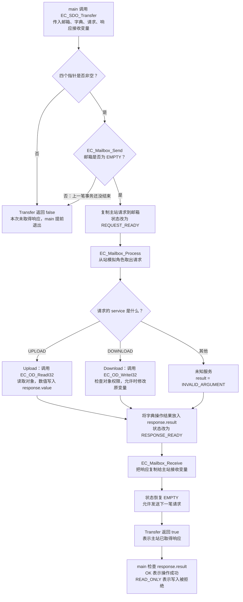

# 程序运行流程图

对照累计 main.c 阅读。第一张图看整段程序的正常执行顺序，第二张图展开一次 SDO 请求。第十、十一课已完成；保留学习者修改的 10000、本地地址 0x1020 和状态样例 0x0023。

第十二、十三课使用独立 main，不包含在下面累计程序中；新增流程图分别见[三模式课程](../EtherCAT_Slave_Simulator/notebook/Lesson_12_位置速度扭矩模式.md)与[周期任务课程](../EtherCAT_Slave_Simulator/notebook/Lesson_13_周期任务看门狗与诊断.md)。总入口为[软件课程结课导航](软件课程结课导航.md)。

第二小节新增字节层，详细编解码流程见[SDO 字节格式课程](../EtherCAT_Slave_Simulator/notebook/Lesson_08_第二步_SDO字节格式.md)。

第九课详细路径及地址表见[SyncManager 与 FMMU 课程](../EtherCAT_Slave_Simulator/notebook/Lesson_09_SyncManager与FMMU.md)。

第十课控制字与三份反馈的循环见[CiA402 基础课程](../EtherCAT_Slave_Simulator/notebook/Lesson_10_CiA402基础.md)。

第十一课四个正常状态、五份命令的处理循环见[CiA402 状态机课程](../EtherCAT_Slave_Simulator/notebook/Lesson_11_CiA402状态机.md)。

第十一课第二步的九份输入及停止完成事件见[快速停止课程](../EtherCAT_Slave_Simulator/notebook/Lesson_11_第二步_快速停止.md)。第一步保留进入条件 false 的练习，第二步从禁止接通开始独立场景。

第十一课第三步的十四份输入、故障处理优先级和复位沿见[故障与复位课程](../EtherCAT_Slave_Simulator/notebook/Lesson_11_第三步_故障与复位.md)。

图中的 SDO 写入值使用你当前练习的 6000；lesson-08-start 标签中的开始示例使用 5000，执行顺序相同。

当前主站和从站是同一个 C 程序中的模拟角色，main 按顺序执行这些步骤；这不是两台设备之间的真实通信。程序只演示一轮，最后退出，没有 1 ms 循环。图中正常路径包括「按预期拒绝写入只读对象」；其他失败检查会让 main 提前 return 1。

## 1. main.c 从开始到结束

```mermaid
flowchart TD
    START(["进入 main"])
    INIT["初始化变量<br/>主站目标位置 2000，其他数据先置零"]
    STATE["第五课：请求状态依次切换<br/>INIT → PRE-OP → SAFE-OP → OP"]

    subgraph PDO["第六课：一次 PDO 命令与反馈交换"]
        P1["主站：EC_PackRxPDO<br/>将控制字、目标位置 2000 打包到 image.outputs"]
        P2["从站：EC_UnpackRxPDO<br/>从 image.outputs 解包，得到目标位置 2000"]
        P3["从站：模拟实际位置为 300<br/>EC_PackTxPDO 打包到 image.inputs"]
        P4["主站：EC_UnpackTxPDO<br/>读出实际位置 300"]
        P1 --> P2 --> P3 --> P4
    end

    subgraph OD["第七课：本地对象字典读写"]
        O1["从站：EC_OD_Init<br/>字典关联已有目标位置和实际位置变量"]
        O2["EC_OD_ReadI32<br/>读取目标位置 2000，再读取实际位置 300"]
        O3["EC_OD_WriteI32<br/>目标位置改为 4000"]
        O4["尝试写实际位置为 999<br/>返回 READ_ONLY，实际位置仍为 300"]
        O1 --> O2 --> O3 --> O4
    end

    subgraph SDO["第八课：通过模拟邮箱访问同一张字典"]
        S1["初始化邮箱与请求<br/>每次 EC_SDO_Transfer 都执行发送、处理、接收"]
        S2["主站请求 Upload 0x607A:00<br/>从站返回目标位置 4000"]
        S3["主站请求 Download 0x607A:00 = 6000<br/>从站更新目标位置，返回 OK"]
        S4["主站再次 Upload 0x607A:00<br/>从站返回目标位置 6000"]
        S5["主站请求 Download 0x6064:00 = 999<br/>从站返回 READ_ONLY，实际位置仍为 300"]
        S1 --> S2 --> S3 --> S4 --> S5
    end

    subgraph WIRE["第八课第二小节：SDO 内容的字节编解码"]
        W1["BuildUpload 构造读请求<br/>ProcessFrame 解码并复用邮箱/OD，返回目标 6000"]
        W2["BuildDownloadI32 构造写请求<br/>目标写为 7000，响应命令 60"]
        W3["再次构造读请求<br/>响应命令 43，解码后得到 7000"]
        W4["写实际位置被拒绝<br/>返回命令 80 与错误码 0x06010002"]
        W1 --> W2 --> W3 --> W4
    end

    subgraph ESC["第九课：PDO 经过 FMMU / SM / PDI"]
        E1["初始化 SM2 / SM3 与两条 FMMU 映射<br/>新阶段主站目标设为 10000"]
        E2["主站打包命令<br/>逻辑 0 映射本地 0x1020，EtherCAT 侧写 SM2"]
        E3["从站 PDI 侧读 SM2，再解包<br/>目标变量及 OD 读数为 10000"]
        E4["从站打包反馈 300，PDI 侧写 SM3<br/>逻辑 0x10 映射本地 0x1010，EtherCAT 侧读"]
        E5["主站解包反馈为 300<br/>验证未映射地址和反向写入均被拒绝"]
        E1 --> E2 --> E3 --> E4 --> E5
    end

    subgraph DRIVE["第十课：CiA402 请求与反馈解码"]
        D1["设置控制字 0x000F，保持目标 10000<br/>打包、经 FMMU / SM2 / PDI 到从站解包"]
        D2["从站解释为请求使能<br/>不根据命令自动生成状态"]
        D3["准备三份反馈样例<br/>0040、0023、00A3；实际位置 300"]
        D4["取下一份状态字，打包反馈<br/>PDI 写 SM3，再经映射由 EtherCAT 侧读取"]
        D5["主站解包，解码驱动状态<br/>分别打印 operation_enabled 与 warning"]
        D6{"还有样例？"}
        D7["打印通信状态 OP<br/>三个样例处理结束"]
        D1 --> D2 --> D3 --> D4 --> D5 --> D6
        D6 -- "有" --> D4
        D6 -- "没有" --> D7
    end

    subgraph FSM["第十一课第一步：根据命令生成反馈"]
        F1["重新初始化驱动状态为禁止接通<br/>准备五份命令及本地进入条件"]
        F2["取下一份命令<br/>打包，经 Rx FMMU / SM2 / PDI 到从站解包"]
        F3["UpdateState 更新 drive<br/>EncodeStatusword 生成状态字"]
        F4["打包反馈，经 PDI / SM3 / Tx FMMU<br/>到主站解包、解码并打印状态"]
        F5{"还有命令？"}
        F6["打印通信 OP、目标 10000、实际 300<br/>五步处理结束"]
        F1 --> F2 --> F3 --> F4 --> F5
        F5 -- "有" --> F2
        F5 -- "没有" --> F6
    end

    subgraph STOP["第十一课第二步：快速停止，固定 Option Code = 2"]
        Q1["重新从禁止接通开始<br/>准备九份命令与本地完成输入"]
        Q2["取本次控制字，经原 Rx PDO 路径到从站"]
        Q3["UpdateState 处理命令<br/>若处于快速停止，则处理本地完成事件"]
        Q4["编码状态字，经原 Tx PDO 路径到主站<br/>解码并打印 Stop step"]
        Q5{"还有输入？"}
        Q6["打印通信 OP、目标 10000、实际 300"]
        Q1 --> Q2 --> Q3 --> Q4 --> Q5
        Q5 -- "有" --> Q2
        Q5 -- "没有" --> Q6
    end
    subgraph FAULTS["第十一课第三步：故障与复位"]
        R1["独立场景从禁止接通开始<br/>初始化复位位历史，准备十四份输入"]
        R2["取本次控制字，经原 RxPDO 路径到从站"]
        R3["ProcessFault 优先处理故障和复位沿<br/>普通状态且 bit7=0 时再调用 UpdateState"]
        R4["编码反馈，经原 TxPDO 路径到主站<br/>解码并打印 Fault step"]
        R5{"还有输入？"}
        R6["打印通信 OP、目标 10000、实际 300"]
        R1 --> R2 --> R3 --> R4 --> R5
        R5 -- "有" --> R2
        R5 -- "没有" --> R6
    end
    FINISH(["return 0，程序结束"])
    START --> INIT --> STATE --> P1
    P4 --> O1
    O4 --> S1
    S5 --> W1
    W4 --> E1
    E5 --> D1
    D7 --> F1
    F6 --> Q1
    Q6 --> R1
    R6 --> FINISH
```

这张图里的 PDO 和 SDO 是为了教学依次演示的两条数据路径，并不表示真实从站每个周期都必须先执行这几个字典测试，再执行四笔 SDO。

沿着图看 main 中相应的注释：准备阶段 → 第 1～4 步 → 第七课 → 第八课 → 第二小节 → 第九课 → 第十课 → 第十一课第一步 → 第二步 → 第三步。每个阶段的 printf 都在对应操作之后，终端输出也按这个顺序出现。第九课补上软件 ESC 数据路径，第十课复用它解释控制字和状态字；第十一课逐步新增状态更新、编码、停止完成事件及故障复位。前面的直接 PDO 交换仍是第六课的对照示例。

## 2. 展开一次 EC_SDO_Transfer

下面是当前模拟器的函数调用顺序。参数完整、邮箱空闲时，Process 和 Receive 会依次成功；各函数还会独立检查自己的输入和邮箱状态。

Process 或 Receive 的参数、状态检查失败时，Transfer 也会返回 false。这张图展开普通完整事务，不模拟网络超时或异步等待。

「Transfer 返回 true」和「response.result 为 OK」是两个判断：写只读对象时，从站正常生成拒绝响应，所以 Transfer 可以返回 true，同时 result 为 READ_ONLY。第八课第一小节的最后一个演示正是在验证这个拒绝结果，符合预期后继续后面的课程阶段。

## 3. 用数字跟踪同一个目标变量

| 执行到哪里 | 从站目标位置 | 原因 |
|---|---|---|
| 程序初始化 | 0 | slave_command 初始化为零 |
| RxPDO 解包后 | 2000 | 收到主站命令 |
| 第七课字典写入后 | 4000 | 你完成的本地字典练习 |
| 第八课首次 Upload 后 | 4000 | 读取不修改变量 |
| 第八课 Download 后 | 6000 | 你修改后的请求通过字典更新同一变量 |
| 第八课再次 Upload 后 | 6000 | 读回修改后的数值 |
| 第二小节字节写请求后 | 7000 | 字节解码还原写请求，通过原字典更新变量 |
| 第二小节再次读取后 | 7000 | 响应字节解码得到新数值 |
| 第九课只把命令写入 SM2 后 | 7000 | 数据区有新字节，应用还没有解包 |
| 第九课 PDI 读取并解包后 | 10000 | 将你修改后的 PDO 字节还原到同一个目标变量 |
| 第九课 OD 读取及两次失败检查后 | 10000 | 读取及预期拒绝均不修改目标变量 |
| 第十课传递控制字及三份反馈后 | 10000 | 本阶段只改控制字和状态字，保留目标值 |
| 第十一课处理五份命令后 | 10000 | 更新驱动状态并生成反馈，不修改目标位置 |
| 第十一课第二步处理九份输入后 | 10000 | 停止及重新使能只更新驱动状态，不修改目标位置 |
| 第十一课第三步处理十四份输入后 | 10000 | 故障、复位及重新使能只更新状态与复位位历史，不修改位置 |

实际位置在模拟编码器赋值后一直是 300；经本地字典、SDO 语义请求和字节请求尝试写成 999 都被拒绝。修改练习数值后，按相同执行顺序理解新的输出。

## 4. 图与源码的对应关系

| 想看的部分 | 文件 | 重点函数 |
|---|---|---|
| 整体执行顺序 | [main.c](../EtherCAT_Slave_Simulator/main.c) | main |
| PDO 数值与字节转换 | [ethercat_pdo.c](../EtherCAT_Slave_Simulator/EtherCAT/ethercat_pdo.c) | EC_PackRxPDO / EC_UnpackRxPDO / TxPDO 对应函数 |
| 按编号访问原变量 | [ethercat_od.c](../EtherCAT_Slave_Simulator/EtherCAT/ethercat_od.c) | EC_OD_Init / EC_OD_ReadI32 / EC_OD_WriteI32 |
| 请求、处理、响应 | [ethercat_sdo.c](../EtherCAT_Slave_Simulator/EtherCAT/ethercat_sdo.c) | EC_SDO_Transfer / EC_Mailbox_Send / Process / Receive |
| SDO 内容的字节布局 | [ethercat_sdo_wire.c](../EtherCAT_Slave_Simulator/EtherCAT/ethercat_sdo_wire.c) | BuildUpload / BuildDownloadI32 / ProcessFrame / GetUploadI32 |
| 逻辑地址到本地地址 | [ethercat_fmmu.c](../EtherCAT_Slave_Simulator/EtherCAT/ethercat_fmmu.c) | EC_FMMU_Translate |
| 两侧对本地数据区的访问 | [ethercat_sm.c](../EtherCAT_Slave_Simulator/EtherCAT/ethercat_sm.c) | EC_SM_Init / EC_SM_Write / EC_SM_Read |
| 控制请求与驱动状态解码 | [cia402.c](../EtherCAT_Slave_Simulator/CiA402/cia402.c) | ControlRequestsEnableOperation / DecodeStatusword / IsOperationEnabled |
| 正常与快速停止状态、完成事件和编码 | [cia402_state.c](../EtherCAT_Slave_Simulator/CiA402/cia402_state.c) | CIA402_UpdateState / CIA402_CompleteQuickStop / CIA402_EncodeStatusword |
| 故障反应、锁存与复位沿 | [cia402_fault.c](../EtherCAT_Slave_Simulator/CiA402/cia402_fault.c) | CIA402_ProcessFault |

先顺着第一张图读 main，再用第二张图查看 SDO 调用了什么。图中的每一步对应一个作用，暂时不用同时展开所有底层函数。
