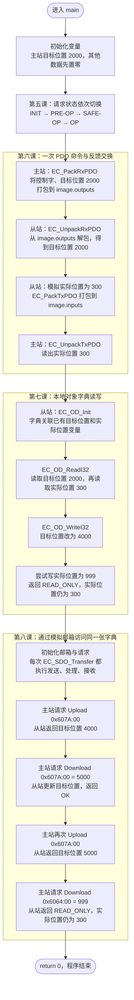
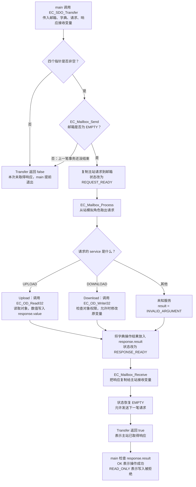

# 程序运行流程图

对照当前 main.c 阅读。第一张图看整段程序的正常执行顺序，第二张图展开一次 SDO 请求。第八课仍在学习中。

当前主站和从站是同一个 C 程序中的模拟角色，main 按顺序执行这些步骤；这不是两台设备之间的真实通信。程序只演示一轮，最后退出，没有 1 ms 循环。图中正常路径包括「按预期拒绝写入只读对象」；其他失败检查会让 main 提前 return 1。

## 1. main.c 从开始到结束

这张图里的 PDO 和 SDO 是为了教学依次演示的两条数据路径，并不表示真实从站每个周期都必须先执行这几个字典测试，再执行四笔 SDO。

沿着图看 main 中相应的注释：准备阶段 → 第 1～4 步 → 第七课从这里开始 → 第八课从这里开始。每个阶段的 printf 都在对应操作之后，终端输出也按这个顺序出现。

## 2. 展开一次 EC_SDO_Transfer

下面是当前模拟器的函数调用顺序。参数完整、邮箱空闲时，Process 和 Receive 会依次成功；各函数还会独立检查自己的输入和邮箱状态。

Process 或 Receive 的参数、状态检查失败时，Transfer 也会返回 false。这张图展开普通完整事务，不模拟网络超时或异步等待。

「Transfer 返回 true」和「response.result 为 OK」是两个判断：写只读对象时，从站正常生成拒绝响应，所以 Transfer 可以返回 true，同时 result 为 READ_ONLY。main 的最后一个演示正是在验证这个拒绝结果，按预期收到 READ_ONLY 后继续正常结束。

## 3. 用数字跟踪同一个目标变量

| 执行到哪里 | 从站目标位置 | 原因 |
|---|---|---|
| 程序初始化 | 0 | slave_command 初始化为零 |
| RxPDO 解包后 | 2000 | 收到主站命令 |
| 第七课字典写入后 | 4000 | 你完成的本地字典练习 |
| 第八课首次 Upload 后 | 4000 | 读取不修改变量 |
| 第八课 Download 后 | 5000 | 写请求通过字典修改同一变量 |
| 第八课再次 Upload 后 | 5000 | 读回修改后的数值 |

实际位置在模拟编码器赋值后一直是 300；两次尝试通过字典或 SDO 写成 999 都被拒绝。修改练习数值后，按相同执行顺序理解新的输出。

## 4. 图与源码的对应关系

| 想看的部分 | 文件 | 重点函数 |
|---|---|---|
| 整体执行顺序 | [main.c](../EtherCAT_Slave_Simulator/main.c) | main |
| PDO 数值与字节转换 | [ethercat_pdo.c](../EtherCAT_Slave_Simulator/EtherCAT/ethercat_pdo.c) | EC_PackRxPDO / EC_UnpackRxPDO / TxPDO 对应函数 |
| 按编号访问原变量 | [ethercat_od.c](../EtherCAT_Slave_Simulator/EtherCAT/ethercat_od.c) | EC_OD_Init / EC_OD_ReadI32 / EC_OD_WriteI32 |
| 请求、处理、响应 | [ethercat_sdo.c](../EtherCAT_Slave_Simulator/EtherCAT/ethercat_sdo.c) | EC_SDO_Transfer / EC_Mailbox_Send / Process / Receive |

先顺着第一张图读 main，再用第二张图查看 SDO 调用了什么。图中的每一步对应一个作用，暂时不用同时展开所有底层函数。
